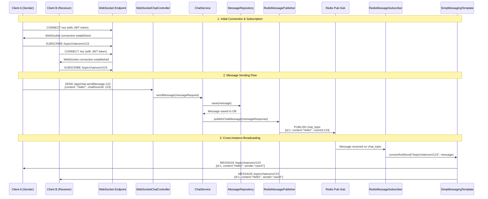

# High-Level Architecture - Real-Time Chat Application

## 📋 Table of Contents

- [System Overview](#system-overview)
- [Technology Stack](#technology-stack)
- [Architecture Layers](#architecture-layers)
- [Package Structure](#package-structure)
- [Core Modules Analysis](#core-modules-analysis)
- [Key Classes & Responsibilities](#key-classes--responsibilities)
- [Component Interactions](#component-interactions)
- [Data Flow Architecture](#data-flow-architecture)
- [Security Architecture](#security-architecture)
- [Real-time Communication](#real-time-communication)
- [Persistence Layer](#persistence-layer)
- [Scalability & Performance](#scalability--performance)

## 🏛️ System Overview

This is a **production-ready, enterprise-grade real-time chat application** built with Spring Boot 3.5.6 and Java 21. The application follows **microservice-ready architecture patterns** with clear separation of concerns, comprehensive security, and horizontal scalability.

### Core Features

- **JWT-based Authentication & Authorization**
- **Real-time WebSocket/STOMP messaging**
- **Multi-instance scalability with Redis pub-sub**
- **PostgreSQL persistence with JPA/Hibernate**
- **OpenAPI/Swagger documentation**
- **Comprehensive security with Spring Security**
- **File upload support for attachments**
- **Direct and group chat rooms**

## 🛠️ Technology Stack

| Layer               | Technology                  | Purpose                                   |
| ------------------- | --------------------------- | ----------------------------------------- |
| **Framework**       | Spring Boot 3.5.6           | Main application framework                |
| **Language**        | Java 21                     | Programming language with modern features |
| **Security**        | Spring Security + JWT       | Authentication & authorization            |
| **WebSocket**       | Spring WebSocket + STOMP    | Real-time communication                   |
| **Persistence**     | Spring Data JPA + Hibernate | ORM and data access                       |
| **Database**        | PostgreSQL                  | Primary relational database               |
| **Caching/Pub-Sub** | Redis                       | Message broadcasting & caching            |
| **Message Queue**   | Apache Kafka                | Event streaming (optional)                |
| **Documentation**   | OpenAPI 3 + Swagger         | API documentation                         |
| **Validation**      | Bean Validation (JSR-303)   | Input validation                          |
| **Testing**         | JUnit 5 + TestContainers    | Testing framework                         |

## 🏗️ Architecture Layers

```
┌─────────────────────────────────────────────────────────────┐
│                    PRESENTATION LAYER                       │
├─────────────────────────────────────────────────────────────┤
│ REST Controllers │ WebSocket Controllers │ Exception Handler │
├─────────────────────────────────────────────────────────────┤
│                     SECURITY LAYER                          │
├─────────────────────────────────────────────────────────────┤
│ JWT Filters │ Authentication │ Authorization │ CORS Config   │
├─────────────────────────────────────────────────────────────┤
│                     BUSINESS LAYER                          │
├─────────────────────────────────────────────────────────────┤
│   Services   │ Business Logic │ Transaction Management       │
├─────────────────────────────────────────────────────────────┤
│                  INTEGRATION LAYER                          │
├─────────────────────────────────────────────────────────────┤
│ Redis Pub-Sub │ WebSocket Messaging │ Event Publishing      │
├─────────────────────────────────────────────────────────────┤
│                   PERSISTENCE LAYER                         │
├─────────────────────────────────────────────────────────────┤
│   Repositories  │    JPA/Hibernate    │    PostgreSQL       │
└─────────────────────────────────────────────────────────────┘
```

## 📁 Package Structure

```
org.arkadipta.chatapp/
├── 📁 config/                  # Configuration Classes
│   ├── SecurityConfig.java     # Spring Security + JWT setup
│   ├── WebSocketConfig.java    # WebSocket/STOMP configuration
│   ├── RedisConfig.java        # Redis pub-sub configuration
│   ├── OpenApiConfig.java      # Swagger/OpenAPI documentation
│   ├── GlobalExceptionHandler.java # Global error handling
│   ├── DataInitializer.java    # Database initialization
│   └── WebSocketEventListener.java # WebSocket lifecycle events
│
├── 📁 controller/              # REST & WebSocket Controllers
│   ├── AuthController.java     # Authentication endpoints
│   ├── ChatController.java     # Chat room REST operations
│   ├── UserController.java     # User management endpoints
│   └── WebSocketChatController.java # Real-time messaging
│
├── 📁 service/                 # Business Logic Layer
│   ├── AuthService.java        # Authentication business logic
│   ├── ChatService.java        # Chat room & messaging logic
│   ├── UserService.java        # User management logic
│   ├── CustomUserDetailsService.java # Spring Security integration
│   └── RedisMessagePublisher.java # Message broadcasting
│
├── 📁 repository/              # Data Access Layer
│   ├── UserRepository.java     # User database operations
│   ├── ChatRoomRepository.java # Chat room database operations
│   └── MessageRepository.java  # Message database operations
│
├── 📁 model/                   # JPA Entity Classes
│   ├── User.java              # User entity + Spring Security UserDetails
│   ├── ChatRoom.java          # Chat room entity
│   ├── Message.java           # Message entity
│   ├── Role.java              # User roles enumeration
│   ├── ChatRoomType.java      # Chat room types (DIRECT, GROUP)
│   └── MessageType.java       # Message types (TEXT, FILE, IMAGE, SYSTEM)
│
├── 📁 security/               # Security Components
│   ├── JwtUtils.java          # JWT token utilities
│   ├── JwtAuthenticationFilter.java # JWT validation filter
│   └── JwtAuthenticationEntryPoint.java # Authentication error handler
│
├── 📁 dto/                    # Data Transfer Objects
│   ├── 📁 auth/               # Authentication DTOs
│   │   ├── LoginRequest.java
│   │   ├── RegisterRequest.java
│   │   ├── AuthResponse.java
│   │   └── RefreshTokenRequest.java
│   ├── 📁 chat/               # Chat-related DTOs
│   │   ├── SendMessageRequest.java
│   │   ├── MessageResponse.java
│   │   ├── CreateChatRoomRequest.java
│   │   └── ChatRoomResponse.java
│   ├── 📁 user/               # User-related DTOs
│   │   ├── UserResponse.java
│   │   └── UpdateUserRequest.java
│   └── ApiResponse.java       # Generic API response wrapper
│
└── ChatappApplication.java    # Spring Boot main application class
```

## 🔧 Core Modules Analysis

### 1. 🔐 Security Module

**Primary Classes:**

- `SecurityConfig.java` - Main security configuration
- `JwtUtils.java` - JWT token operations
- `JwtAuthenticationFilter.java` - Token validation filter
- `JwtAuthenticationEntryPoint.java` - Authentication error handling

**Responsibilities:**

- JWT-based stateless authentication
- BCrypt password hashing
- CORS configuration for frontend integration
- Method-level security annotations support
- Custom authentication filters
- Exception handling for auth failures

### 2. 🌐 WebSocket Module

**Primary Classes:**

- `WebSocketConfig.java` - WebSocket/STOMP setup
- `WebSocketChatController.java` - Real-time message handling
- `WebSocketEventListener.java` - Connection lifecycle management

**Responsibilities:**

- Real-time bidirectional communication
- STOMP protocol message routing
- JWT authentication for WebSocket connections
- User presence tracking
- Message broadcasting to subscribed clients

### 3. 💼 Business Logic Module

**Primary Classes:**

- `ChatService.java` - Chat operations and messaging logic
- `UserService.java` - User management operations
- `AuthService.java` - Authentication business logic

**Responsibilities:**

- Core business rules enforcement
- Transaction management
- Data validation
- Cross-cutting concerns
- Integration with external services

### 4. 🗄️ Persistence Module

**Primary Classes:**

- `UserRepository.java` - User data access
- `ChatRoomRepository.java` - Chat room data access
- `MessageRepository.java` - Message data access

**Responsibilities:**

- Database operations abstraction
- Custom query implementations
- Pagination support
- Optimized database queries

## 🎯 Key Classes & Responsibilities

### REST API Controllers

| Class              | Endpoints       | Responsibilities                                        |
| ------------------ | --------------- | ------------------------------------------------------- |
| **AuthController** | `/api/auth/**`  | User authentication, registration, JWT token management |
| **ChatController** | `/api/chat/**`  | Chat room CRUD, message history, participant management |
| **UserController** | `/api/users/**` | User profile management, search, presence updates       |

### WebSocket Controllers

| Class                       | Message Mappings | Responsibilities                                             |
| --------------------------- | ---------------- | ------------------------------------------------------------ |
| **WebSocketChatController** | `/app/chat.**`   | Real-time message handling, typing indicators, user presence |

### Security Components

| Class                           | Type          | Responsibilities                                         |
| ------------------------------- | ------------- | -------------------------------------------------------- |
| **SecurityConfig**              | Configuration | Security filter chain, CORS, authentication providers    |
| **JwtUtils**                    | Utility       | JWT generation, validation, token parsing                |
| **JwtAuthenticationFilter**     | Filter        | Request interception, token validation, security context |
| **JwtAuthenticationEntryPoint** | Handler       | Authentication error responses                           |

### Service Layer

| Class                        | Domain          | Responsibilities                                                 |
| ---------------------------- | --------------- | ---------------------------------------------------------------- |
| **AuthService**              | Authentication  | Login logic, token generation, user registration                 |
| **ChatService**              | Messaging       | Chat room operations, message processing, real-time coordination |
| **UserService**              | User Management | Profile operations, user search, presence tracking               |
| **CustomUserDetailsService** | Security        | Spring Security UserDetails loading                              |

### Repository Layer

| Class                  | Entity   | Key Operations                                         |
| ---------------------- | -------- | ------------------------------------------------------ |
| **UserRepository**     | User     | Authentication queries, user search, presence tracking |
| **ChatRoomRepository** | ChatRoom | Room discovery, participant queries, room management   |
| **MessageRepository**  | Message  | Message history, pagination, search operations         |

### Model Layer (JPA Entities)

| Class        | Purpose                     | Key Features                                  |
| ------------ | --------------------------- | --------------------------------------------- |
| **User**     | User data + Spring Security | UserDetails implementation, role-based auth   |
| **ChatRoom** | Chat room information       | Direct/Group types, participant management    |
| **Message**  | Message storage             | Multiple types, soft deletion, thread support |

## 🔄 Component Interactions

### Authentication Flow

```
1. Client → AuthController.login()
2. AuthController → AuthService.authenticate()
3. AuthService → UserService.loadUserByUsername()
4. UserService → UserRepository.findByUsername()
5. AuthService → JwtUtils.generateToken()
6. AuthController ← JWT tokens
7. Client ← Authentication response
```

### Real-time Messaging Flow

```
1. Client → WebSocket: /app/chat.sendMessage
2. WebSocketChatController.sendMessage()
3. ChatService.sendMessage()
4. MessageRepository.save()
5. RedisMessagePublisher.publishMessage()
6. Redis → All instances
7. WebSocket → All subscribed clients
```

### REST API Request Flow

```
1. Client → HTTP Request
2. JwtAuthenticationFilter.doFilterInternal()
3. JwtUtils.validateToken()
4. SecurityContext.setAuthentication()
5. Controller method execution
6. Service layer processing
7. Repository database operations
8. Response to client
```

## 🛡️ Security Architecture

### Authentication Mechanism

- **Stateless JWT tokens** - No server-side sessions
- **BCrypt password hashing** - Secure password storage
- **Role-based authorization** - USER/ADMIN roles
- **Method-level security** - @PreAuthorize annotations

### Security Filters Chain

```
1. CorsFilter (CORS handling)
2. JwtAuthenticationFilter (JWT validation)
3. UsernamePasswordAuthenticationFilter
4. DefaultLoginPageGeneratingFilter
5. BasicAuthenticationFilter
6. SessionManagementFilter
7. ExceptionTranslationFilter
8. FilterSecurityInterceptor
```

### Protected Endpoints

- **Public**: `/api/auth/**`, `/swagger-ui/**`, `/ws/**`
- **Authenticated**: `/api/chat/**`, `/api/users/**`
- **Role-based**: Admin operations require ADMIN role

## 🔄 Real-time Communication

### WebSocket Architecture

- **STOMP Protocol** - Message routing and subscription management
- **JWT Authentication** - Token-based WebSocket authentication
- **Topic-based Broadcasting** - `/topic/chatroom/{roomId}`
- **User-specific Queues** - `/queue/user/{username}`

### Message Routing

```
┌─────────────────┐    ┌──────────────────┐    ┌─────────────────┐
│   Client A      │    │  Spring Server   │    │   Client B      │
│                 │    │                  │    │                 │
│ Send Message    │───▶│ WebSocket        │───▶│ Receive Message │
│ /app/chat.send  │    │ Controller       │    │ /topic/room/123 │
│                 │    │                  │    │                 │
│ Subscribe       │◄───│ Redis Pub-Sub    │◄───│ Subscribe       │
│ /topic/room/123 │    │ Broadcasting     │    │ /topic/room/123 │
└─────────────────┘    └──────────────────┘    └─────────────────┘
```

### Redis Integration

- **Message Broadcasting** - Cross-instance message delivery
- **Scalability** - Horizontal scaling support
- **Pub-Sub Pattern** - Event-driven architecture
- **Session Storage** - Distributed session management (optional)

## � Complete Message Flow: Client → Server → Client

### WebSocket Connection & Subscription Flow



### Detailed Message Flow Architecture

```
📱 Client A (Sender)                    🖥️  Spring Boot Server                     📱 Client B (Receiver)
┌─────────────────┐                    ┌──────────────────────────────────────┐    ┌─────────────────┐
│                 │                    │                                      │    │                 │
│ 1. Send Message │────────────────────▶│ WebSocket Endpoint: /ws             │    │ 5. Receive      │
│   SEND /app/    │                    │ ┌──────────────────────────────────┐ │    │   Message       │
│   chat.send     │                    │ │ WebSocketChatController          │ │    │                 │
│   Message.123   │                    │ │ @MessageMapping                  │ │◀───│ SUBSCRIBE       │
│                 │                    │ │ ("/chat.sendMessage.{roomId}")   │ │    │ /topic/         │
│                 │                    │ └──────────────────────────────────┘ │    │ chatroom/123    │
└─────────────────┘                    │                ▼                     │    └─────────────────┘
                                       │ ┌──────────────────────────────────┐ │
                                       │ │ ChatService                      │ │
                                       │ │ - sendMessage()                  │ │
                                       │ │ - Save to database              │ │
                                       │ │ - Business logic validation     │ │
                                       │ └──────────────────────────────────┘ │
                                       │                ▼                     │
                                       │ ┌──────────────────────────────────┐ │
                                       │ │ MessageRepository (JPA)          │ │
                                       │ │ - PostgreSQL persistence         │ │
                                       │ │ - Message entity storage         │ │
                                       │ └──────────────────────────────────┘ │
                                       │                ▼                     │
                                       │ ┌──────────────────────────────────┐ │
                                       │ │ RedisMessagePublisher            │ │
                                       │ │ - Cross-instance broadcasting    │ │
                                       │ │ - Publish to 'chat_topic'        │ │
                                       │ └──────────────────────────────────┘ │
                                       └──────────────────────────────────────┘
                                                          ▼
┌─────────────────────────────────────────────────────────────────────────────────────────┐
│                            🔄 Redis Pub-Sub System                                        │
│  📢 TOPIC: 'chat_topic'                                                                  │
│  📋 Message: {"id":1, "content":"Hello!", "chatRoomId":123, "sender":"userA"}           │
│  📡 Broadcasting to ALL application instances                                             │
└─────────────────────────────────────────────────────────────────────────────────────────┘
                                                          ▼
                                       ┌──────────────────────────────────────┐
                                       │ 🖥️  All Server Instances               │
                                       │ ┌──────────────────────────────────┐ │
                                       │ │ RedisMessageSubscriber           │ │
                                       │ │ - Receives Redis messages        │ │
                                       │ │ - @RedisListener annotation      │ │
                                       │ └──────────────────────────────────┘ │
                                       │                ▼                     │
                                       │ ┌──────────────────────────────────┐ │
                                       │ │ SimpMessagingTemplate            │ │
                                       │ │ - WebSocket message broadcaster  │ │
                                       │ │ - Topic-based routing            │ │
                                       │ │ - User-specific queues           │ │
                                       │ └──────────────────────────────────┘ │
                                       └──────────────────────────────────────┘
                                                          ▼
📱 All Subscribed Clients              📡 WebSocket Broadcasting                📱 All Subscribed Clients
┌─────────────────┐                   ┌──────────────────────────────────┐     ┌─────────────────┐
│ Client A        │◀──────────────────│ TOPIC: /topic/chatroom/123       │────▶│ Client B        │
│ (Sender)        │                   │ MESSAGE: {                       │     │ (Receiver)      │
│                 │                   │   id: 1,                         │     │                 │
│ Also receives   │                   │   content: "Hello!",             │     │ Receives new    │
│ own message     │                   │   sender: "userA",               │     │ message in      │
│ for UI update   │                   │   timestamp: "2025-09-29..."     │     │ real-time       │
│                 │                   │ }                                │     │                 │
└─────────────────┘                   └──────────────────────────────────┘     └─────────────────┘
```

### WebSocket Endpoints & Topics Reference

| Component        | Endpoint/Topic                    | Purpose                    | Message Format            |
| ---------------- | --------------------------------- | -------------------------- | ------------------------- |
| **Connection**   | `/ws` or `/chat`                  | WebSocket handshake        | SockJS fallback supported |
| **Send Message** | `/app/chat.sendMessage.{roomId}`  | Client → Server message    | `SendMessageRequest`      |
| **Room Topic**   | `/topic/chatroom/{roomId}`        | Server → Clients broadcast | `MessageResponse`         |
| **Public Topic** | `/topic/public`                   | General broadcasts         | `MessageResponse`         |
| **User Queue**   | `/user/{username}/queue/errors`   | Private error messages     | Error strings             |
| **Status Topic** | `/topic/chatroom/{roomId}/status` | User online/offline status | Status strings            |
| **Typing Topic** | `/topic/chatroom/{roomId}/typing` | Typing indicators          | `TypingIndicator`         |

### Message Types & Controllers

```java
// 1. WebSocket Message Mappings
@MessageMapping("/chat.sendMessage.{roomId}")      // Room-specific messages
@MessageMapping("/chat.sendMessage")               // General messages
@MessageMapping("/chat.typing.{roomId}")           // Typing indicators
@SubscribeMapping("/topic/chatroom/{roomId}")      // Room subscription

// 2. WebSocket Send Destinations
@SendTo("/topic/public")                           // Public broadcast
messagingTemplate.convertAndSend("/topic/chatroom/" + roomId, response)
messagingTemplate.convertAndSend("/user/" + username + "/queue/errors", error)

// 3. Redis Topics (Cross-Instance)
RedisConfig.CHAT_TOPIC = "chat_topic"             // Message broadcasting
RedisConfig.USER_STATUS_TOPIC = "user_status_topic" // Status updates
```

### Real-time Features Flow

1. **Message Sending**: `/app/chat.sendMessage.{roomId}` → `WebSocketChatController.sendMessageToRoom()`
2. **Database Persistence**: `ChatService.sendMessage()` → `MessageRepository.save()`
3. **Cross-Instance Sync**: `RedisMessagePublisher.publishChatMessage()` → Redis pub-sub
4. **Message Broadcasting**: `RedisMessageSubscriber` → `SimpMessagingTemplate.convertAndSend()`
5. **Client Delivery**: WebSocket → `/topic/chatroom/{roomId}` → All subscribed clients

### Error Handling & Fallbacks

- **Authentication**: JWT validation in WebSocket interceptor
- **Message Failures**: Error sent to `/user/{username}/queue/errors`
- **Redis Unavailable**: Falls back to single-instance mode
- **Connection Lost**: SockJS provides automatic reconnection
- **Invalid Messages**: Validation in controller with error responses

## �🗄️ Persistence Layer

### Database Schema

```sql
-- Users table with Spring Security integration
users (id, username, email, password_hash, role, is_online, last_seen)

-- Chat rooms for direct and group conversations
chat_rooms (id, name, description, type, created_by, created_at, is_active)

-- Messages with soft deletion and threading support
messages (id, content, type, sender_id, chat_room_id, reply_to_id, timestamp, is_deleted)

-- Many-to-many relationship for chat room participants
chat_room_participants (chat_room_id, user_id, joined_at, role)
```

### Repository Features

- **Spring Data JPA** - Automatic query generation
- **Custom Queries** - Optimized database operations
- **Pagination Support** - Large dataset handling
- **Soft Deletion** - Data preservation for audit
- **Indexing Strategy** - Performance optimization

### Transaction Management

- **@Transactional** - Declarative transaction management
- **Isolation Levels** - Data consistency
- **Rollback Rules** - Error handling
- **Read-only Optimization** - Query performance

## 🚀 Scalability & Performance

### Horizontal Scaling

- **Stateless Design** - Easy instance replication
- **Redis Pub-Sub** - Cross-instance communication
- **Database Connection Pooling** - Resource optimization
- **Load Balancer Ready** - Session-less architecture

### Performance Optimizations

- **JPA Query Optimization** - Efficient database access
- **Lazy Loading** - Resource conservation
- **Connection Pooling** - Database performance
- **Caching Strategy** - Redis integration points
- **WebSocket Keep-alive** - Connection maintenance

### Monitoring & Observability

- **Actuator Endpoints** - Health checks and metrics
- **Comprehensive Logging** - Debug and audit trails
- **Error Handling** - Graceful failure management
- **OpenAPI Documentation** - API testing and integration

## 📊 Architecture Strengths

✅ **Separation of Concerns** - Clear layer boundaries
✅ **Security-First Design** - Comprehensive security implementation
✅ **Real-time Capabilities** - WebSocket/STOMP integration
✅ **Scalability Ready** - Multi-instance support
✅ **Enterprise Patterns** - Industry best practices
✅ **Documentation** - OpenAPI/Swagger integration
✅ **Testing Support** - TestContainers integration
✅ **Modern Technology** - Java 21 and Spring Boot 3.5.6

This architecture provides a solid foundation for a production-ready chat application with room for feature expansion and scaling.
