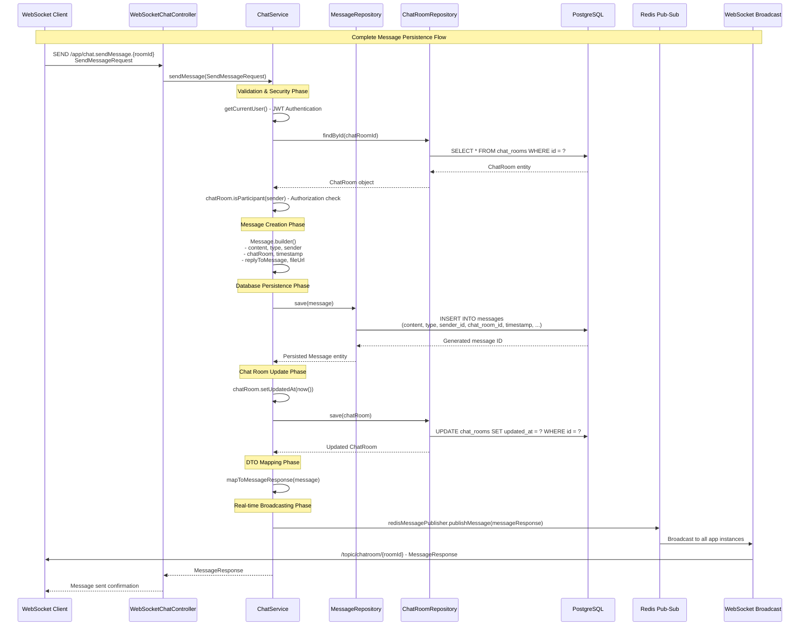

# JPA Entities & Data Persistence Guide

## 📋 Table of Contents

- [JPA Entity Overview](#jpa-entity-overview)
- [Entity-Repository Mapping](#entity-repository-mapping)
- [Message Persistence Flow](#message-persistence-flow)
- [Data Relationships & Associations](#data-relationships--associations)
- [Phase 2 Persistence Enhancements](#phase-2-persistence-enhancements)
- [Database Schema Design](#database-schema-design)
- [Migration Requirements for Phase 2](#migration-requirements-for-phase-2)

## 🗄️ JPA Entity Overview

### Core Entities Identified

The chat application implements **3 primary JPA entities** that form the backbone of the data persistence layer:

#### **1. User Entity** (`User.java`)

```java
@Entity
@Table(name = "users", uniqueConstraints = {
    @UniqueConstraint(columnNames = "username"),
    @UniqueConstraint(columnNames = "email")
})
public class User implements UserDetails {
    @Id
    @GeneratedValue(strategy = GenerationType.IDENTITY)
    private Long id;

    // Authentication fields
    @Column(nullable = false, unique = true, length = 50)
    private String username;

    @Column(nullable = false, unique = true, length = 100)
    private String email;

    @Column(nullable = false)
    private String password; // BCrypt hashed

    // Profile information
    @Column(name = "first_name", length = 50)
    private String firstName;

    @Column(name = "last_name", length = 50)
    private String lastName;

    // Status tracking
    @Column(name = "is_online")
    @Builder.Default
    private Boolean isOnline = false;

    @Column(name = "last_seen")
    private LocalDateTime lastSeen;

    // Authorization
    @Enumerated(EnumType.STRING)
    @Builder.Default
    private Role role = Role.USER;

    @Column(name = "is_enabled")
    @Builder.Default
    private Boolean isEnabled = true;

    // Audit fields
    @Column(name = "created_at", nullable = false, updatable = false)
    private LocalDateTime createdAt;

    @Column(name = "updated_at")
    private LocalDateTime updatedAt;
}
```

**Data Stored:**

- **Authentication**: Username, email, BCrypt password
- **Profile**: First/last name, profile picture URL
- **Status**: Online/offline status, last seen timestamp
- **Authorization**: Role (USER/ADMIN), account enabled status
- **Audit**: Creation and update timestamps

#### **2. ChatRoom Entity** (`ChatRoom.java`)

```java
@Entity
@Table(name = "chat_rooms")
public class ChatRoom {
    @Id
    @GeneratedValue(strategy = GenerationType.IDENTITY)
    private Long id;

    @Column(nullable = false, length = 100)
    private String name;

    @Column(length = 500)
    private String description;

    @Enumerated(EnumType.STRING)
    @Column(nullable = false)
    private ChatRoomType type; // DIRECT or GROUP

    @ManyToOne(fetch = FetchType.LAZY)
    @JoinColumn(name = "created_by", nullable = false)
    private User createdBy;

    @Column(name = "created_at", nullable = false, updatable = false)
    private LocalDateTime createdAt;

    @Column(name = "updated_at")
    private LocalDateTime updatedAt;

    @Column(name = "is_active")
    @Builder.Default
    private Boolean isActive = true;

    @Column(name = "room_image_url")
    private String roomImageUrl;

    // Many-to-many relationship with users
    @ManyToMany(fetch = FetchType.LAZY, cascade = {CascadeType.PERSIST, CascadeType.MERGE})
    @JoinTable(
        name = "chat_room_participants",
        joinColumns = @JoinColumn(name = "chat_room_id"),
        inverseJoinColumns = @JoinColumn(name = "user_id")
    )
    private Set<User> participants = new HashSet<>();

    // One-to-many relationship with messages
    @OneToMany(mappedBy = "chatRoom", fetch = FetchType.LAZY, cascade = CascadeType.ALL)
    private Set<Message> messages = new HashSet<>();
}
```

**Data Stored:**

- **Basic Info**: Name, description, room image URL
- **Type Classification**: DIRECT (1-to-1) or GROUP (multi-user)
- **Ownership**: Created by user reference
- **Status**: Active/inactive flag for soft deletion
- **Audit**: Creation and update timestamps
- **Relationships**: Participants (many-to-many), messages (one-to-many)

#### **3. Message Entity** (`Message.java`)

```java
@Entity
@Table(name = "messages")
public class Message {
    @Id
    @GeneratedValue(strategy = GenerationType.IDENTITY)
    private Long id;

    @Column(nullable = false, columnDefinition = "TEXT")
    private String content;

    @Enumerated(EnumType.STRING)
    @Column(nullable = false)
    @Builder.Default
    private MessageType type = MessageType.TEXT; // TEXT, IMAGE, FILE, SYSTEM

    @ManyToOne(fetch = FetchType.LAZY, optional = false)
    @JoinColumn(name = "sender_id", nullable = false)
    private User sender;

    @ManyToOne(fetch = FetchType.LAZY, optional = false)
    @JoinColumn(name = "chat_room_id", nullable = false)
    private ChatRoom chatRoom;

    @Column(name = "timestamp", nullable = false, updatable = false)
    private LocalDateTime timestamp;

    // Threading support
    @ManyToOne(fetch = FetchType.LAZY)
    @JoinColumn(name = "reply_to_message_id")
    private Message replyToMessage;

    @OneToMany(mappedBy = "replyToMessage", fetch = FetchType.LAZY)
    private Set<Message> replies = new HashSet<>();

    // File attachment support
    @Column(name = "file_url")
    private String fileUrl;

    @Column(name = "file_name")
    private String fileName;

    @Column(name = "file_size")
    private Long fileSize;

    @Column(name = "file_type")
    private String fileType;

    // Message editing
    @Column(name = "is_edited")
    @Builder.Default
    private Boolean isEdited = false;

    @Column(name = "edited_at")
    private LocalDateTime editedAt;

    // Soft deletion
    @Column(name = "is_deleted")
    @Builder.Default
    private Boolean isDeleted = false;

    @Column(name = "deleted_at")
    private LocalDateTime deletedAt;
}
```

**Data Stored:**

- **Content**: Message text (TEXT column for long content)
- **Type**: TEXT, IMAGE, FILE, or SYSTEM message
- **Relationships**: Sender (User), chat room (ChatRoom)
- **Threading**: Reply-to-message support for conversations
- **File Attachments**: URL, name, size, type for media messages
- **Message State**: Edit history, soft deletion support
- **Timestamps**: Send time, edit time, deletion time

### Supporting Enums

#### **ChatRoomType.java**

```java
public enum ChatRoomType {
    DIRECT,  // One-to-one chat between two users
    GROUP    // Group chat with multiple users
}
```

#### **MessageType.java**

```java
public enum MessageType {
    TEXT,    // Plain text message
    IMAGE,   // Image attachment
    FILE,    // File attachment
    SYSTEM   // System-generated message (user joined/left, etc.)
}
```

#### **Role.java**

```java
public enum Role {
    USER,    // Regular user with basic permissions
    ADMIN    // Administrator with management permissions
}
```

## 🔗 Entity-Repository Mapping

### Repository Interfaces and Capabilities

#### **1. UserRepository** (`UserRepository.java`)

```java
@Repository
public interface UserRepository extends JpaRepository<User, Long> {

    // Authentication queries
    Optional<User> findByUsername(String username);
    Optional<User> findByEmail(String email);

    // Uniqueness validation
    boolean existsByUsername(String username);
    boolean existsByEmail(String email);

    // User search and discovery
    @Query("SELECT u FROM User u WHERE " +
           "LOWER(u.username) LIKE LOWER(CONCAT('%', :searchTerm, '%')) OR " +
           "LOWER(u.firstName) LIKE LOWER(CONCAT('%', :searchTerm, '%')) OR " +
           "LOWER(u.lastName) LIKE LOWER(CONCAT('%', :searchTerm, '%')) OR " +
           "LOWER(u.email) LIKE LOWER(CONCAT('%', :searchTerm, '%'))")
    Page<User> searchUsers(@Param("searchTerm") String searchTerm, Pageable pageable);

    // Presence tracking
    List<User> findByIsOnlineTrue();

    @Query("SELECT u FROM User u WHERE u.isOnline = true AND u.id IN :userIds")
    List<User> findOnlineUsersByIds(@Param("userIds") List<Long> userIds);

    // Bulk operations
    List<User> findByIdIn(List<Long> userIds);
}
```

**Primary Functions:**

- **Authentication**: Find users by username/email for login
- **Registration**: Check username/email uniqueness
- **User Discovery**: Multi-field search across profile data
- **Presence Tracking**: Online/offline status queries
- **Bulk Operations**: Retrieve multiple users efficiently

#### **2. ChatRoomRepository** (`ChatRoomRepository.java`)

```java
@Repository
public interface ChatRoomRepository extends JpaRepository<ChatRoom, Long> {

    // User's chat rooms
    @Query("SELECT cr FROM ChatRoom cr JOIN cr.participants p " +
           "WHERE p.id = :userId AND cr.isActive = true")
    Page<ChatRoom> findActiveRoomsByUserId(@Param("userId") Long userId, Pageable pageable);

    // Direct chat management
    @Query("SELECT cr FROM ChatRoom cr JOIN cr.participants p1 JOIN cr.participants p2 " +
           "WHERE cr.type = 'DIRECT' AND p1.id = :userId1 AND p2.id = :userId2 AND cr.isActive = true")
    Optional<ChatRoom> findDirectChatBetweenUsers(@Param("userId1") Long userId1, @Param("userId2") Long userId2);

    // Chat room search
    @Query("SELECT cr FROM ChatRoom cr JOIN cr.participants p " +
           "WHERE p.id = :userId AND cr.isActive = true AND " +
           "(LOWER(cr.name) LIKE LOWER(CONCAT('%', :searchTerm, '%')) OR " +
           "LOWER(cr.description) LIKE LOWER(CONCAT('%', :searchTerm, '%')))")
    List<ChatRoom> searchUserChatRooms(@Param("userId") Long userId, @Param("searchTerm") String searchTerm);

    // Participation validation
    @Query("SELECT COUNT(p) > 0 FROM ChatRoom cr JOIN cr.participants p " +
           "WHERE cr.id = :chatRoomId AND p.id = :userId")
    boolean isUserParticipant(@Param("chatRoomId") Long chatRoomId, @Param("userId") Long userId);

    // Statistics
    @Query("SELECT COUNT(p) FROM ChatRoom cr JOIN cr.participants p WHERE cr.id = :chatRoomId")
    Long countParticipants(@Param("chatRoomId") Long chatRoomId);
}
```

**Primary Functions:**

- **Chat Room Discovery**: Find user's active chat rooms with pagination
- **Direct Chat Management**: Find/create direct chats between users
- **Search Functionality**: Search chat rooms by name/description
- **Access Control**: Validate user participation in chat rooms
- **Analytics**: Count participants and room statistics

#### **3. MessageRepository** (`MessageRepository.java`)

```java
@Repository
public interface MessageRepository extends JpaRepository<Message, Long> {

    // Chat history with pagination
    Page<Message> findByChatRoomIdAndIsDeletedFalseOrderByTimestampDesc(Long chatRoomId, Pageable pageable);

    // Chat history (all messages)
    List<Message> findByChatRoomIdAndIsDeletedFalseOrderByTimestampAsc(Long chatRoomId);

    // Latest messages
    @Query("SELECT m FROM Message m WHERE m.chatRoom.id = :chatRoomId AND m.isDeleted = false " +
           "ORDER BY m.timestamp DESC")
    List<Message> findLatestMessagesByChatRoom(@Param("chatRoomId") Long chatRoomId, Pageable pageable);

    // User message history
    List<Message> findBySenderIdAndIsDeletedFalseOrderByTimestampDesc(Long senderId);

    // Message type filtering
    List<Message> findByTypeAndIsDeletedFalseOrderByTimestampDesc(MessageType type);

    // Time-based queries
    @Query("SELECT m FROM Message m WHERE m.chatRoom.id = :chatRoomId AND m.isDeleted = false " +
           "AND m.timestamp BETWEEN :startTime AND :endTime ORDER BY m.timestamp ASC")
    List<Message> findMessagesBetweenTimestamps(@Param("chatRoomId") Long chatRoomId,
                                              @Param("startTime") LocalDateTime startTime,
                                              @Param("endTime") LocalDateTime endTime);

    // Statistics
    @Query("SELECT COUNT(m) FROM Message m WHERE m.chatRoom.id = :chatRoomId AND m.isDeleted = false")
    Long countMessagesByChatRoom(@Param("chatRoomId") Long chatRoomId);

    // Unread message counting
    @Query("SELECT COUNT(m) FROM Message m WHERE m.chatRoom.id = :chatRoomId AND m.isDeleted = false " +
           "AND m.sender.id != :userId AND m.timestamp > :lastSeenTimestamp")
    Long countUnreadMessages(@Param("chatRoomId") Long chatRoomId,
                           @Param("userId") Long userId,
                           @Param("lastSeenTimestamp") LocalDateTime lastSeenTimestamp);

    // Latest messages for user's chat rooms
    @Query("SELECT m FROM Message m WHERE m.id IN " +
           "(SELECT MAX(m2.id) FROM Message m2 WHERE m2.chatRoom.id IN " +
           "(SELECT cr.id FROM ChatRoom cr JOIN cr.participants p WHERE p.id = :userId) " +
           "AND m2.isDeleted = false GROUP BY m2.chatRoom.id)")
    List<Message> findLatestMessagesForUserChatRooms(@Param("userId") Long userId);

    // File messages
    List<Message> findByChatRoomIdAndTypeInAndIsDeletedFalse(Long chatRoomId, List<MessageType> types);
}
```

**Primary Functions:**

- **Chat History**: Paginated message retrieval with ordering
- **Real-time Messaging**: Latest message queries for live updates
- **Message Analytics**: Count messages, unread counts
- **File Management**: Query messages with attachments
- **Time-based Filtering**: Messages within date ranges
- **User Activity**: Message history per user

## 💾 Message Persistence Flow

### Complete Message Flow: WebSocket → Service → Repository → Database



### Step-by-Step Persistence Breakdown

#### **Step 1: WebSocket Message Reception**

```java
// WebSocketChatController.java
@MessageMapping("/chat.sendMessage.{roomId}")
public void sendMessageToRoom(@DestinationVariable String roomId,
                             @Payload SendMessageRequest messageRequest,
                             Principal principal) {
    try {
        Long chatRoomId = Long.parseLong(roomId);
        messageRequest.setChatRoomId(chatRoomId);

        // Delegate to service layer
        MessageResponse response = chatService.sendMessage(messageRequest);

        // Broadcast to chat room
        String destination = "/topic/chatroom/" + roomId;
        messagingTemplate.convertAndSend(destination, response);

    } catch (Exception e) {
        // Send error to user's private queue
        String errorDestination = "/user/" + principal.getName() + "/queue/errors";
        messagingTemplate.convertAndSend(errorDestination, "Failed to send message: " + e.getMessage());
    }
}
```

#### **Step 2: Service Layer Processing**

```java
// ChatService.java
@Transactional
public MessageResponse sendMessage(SendMessageRequest request) {
    // 1. Authentication & Authorization
    User sender = userService.getCurrentUser();

    // 2. Chat Room Validation
    ChatRoom chatRoom = chatRoomRepository.findById(request.getChatRoomId())
            .orElseThrow(() -> new RuntimeException("Chat room not found"));

    if (!chatRoom.isParticipant(sender)) {
        throw new RuntimeException("User is not a participant in this chat room");
    }

    // 3. Message Type Validation
    MessageType messageType = MessageType.valueOf(request.getType().toUpperCase());

    // 4. Reply Message Validation (if applicable)
    Message replyToMessage = null;
    if (request.getReplyToMessageId() != null) {
        replyToMessage = messageRepository.findById(request.getReplyToMessageId())
                .orElseThrow(() -> new RuntimeException("Reply to message not found"));
    }

    // 5. Message Entity Creation
    Message message = Message.builder()
            .content(request.getContent())
            .type(messageType)
            .sender(sender)
            .chatRoom(chatRoom)
            .timestamp(LocalDateTime.now())
            .replyToMessage(replyToMessage)
            .fileUrl(request.getFileUrl())
            .fileName(request.getFileName())
            .fileSize(request.getFileSize())
            .fileType(request.getFileType())
            .build();

    // 6. Database Persistence
    message = messageRepository.save(message);

    // 7. Chat Room Timestamp Update
    chatRoom.setUpdatedAt(LocalDateTime.now());
    chatRoomRepository.save(chatRoom);

    // 8. DTO Mapping
    MessageResponse messageResponse = mapToMessageResponse(message);

    // 9. Real-time Broadcasting
    sendRealTimeMessage(chatRoom, messageResponse);

    return messageResponse;
}
```

#### **Step 3: Repository Layer Operations**

##### **Message Persistence**

```java
// MessageRepository.save() generates SQL:
INSERT INTO messages (
    content, type, sender_id, chat_room_id, timestamp,
    reply_to_message_id, file_url, file_name, file_size, file_type,
    is_edited, is_deleted, created_at, updated_at
) VALUES (
    ?, ?, ?, ?, ?,
    ?, ?, ?, ?, ?,
    ?, ?, ?, ?
);
```

##### **Chat Room Update**

```java
// ChatRoomRepository.save() generates SQL:
UPDATE chat_rooms
SET updated_at = ?,
    room_image_url = ?
WHERE id = ?;
```

#### **Step 4: Real-time Broadcasting**

```java
// ChatService.java
private void sendRealTimeMessage(ChatRoom chatRoom, MessageResponse messageResponse) {
    // Local WebSocket broadcasting
    String destination = "/topic/chatroom/" + chatRoom.getId();
    messagingTemplate.convertAndSend(destination, messageResponse);

    // Cross-instance Redis broadcasting
    redisMessagePublisher.publishMessage(messageResponse);
}
```

### Data Transfer Objects (DTOs)

#### **Input DTO: SendMessageRequest**

```java
@Data
@Builder
public class SendMessageRequest {
    @NotNull
    @JsonProperty("chat_room_id")
    private Long chatRoomId;

    @NotBlank
    @Size(max = 5000)
    private String content;

    @Builder.Default
    private String type = "TEXT";

    @JsonProperty("reply_to_message_id")
    private Long replyToMessageId;

    @JsonProperty("file_url")
    private String fileUrl;

    @JsonProperty("file_name")
    private String fileName;

    @JsonProperty("file_size")
    private Long fileSize;

    @JsonProperty("file_type")
    private String fileType;
}
```

#### **Output DTO: MessageResponse**

```java
@Data
@Builder
public class MessageResponse {
    private Long id;
    private String content;
    private String type;
    private SenderInfo sender;

    @JsonProperty("chat_room_id")
    private Long chatRoomId;

    private LocalDateTime timestamp;

    @JsonProperty("is_edited")
    private Boolean isEdited;

    @JsonProperty("edited_at")
    private LocalDateTime editedAt;

    @JsonProperty("file_url")
    private String fileUrl;

    @JsonProperty("file_name")
    private String fileName;

    @JsonProperty("file_size")
    private Long fileSize;

    @JsonProperty("file_type")
    private String fileType;

    @JsonProperty("reply_to_message")
    private ReplyMessageInfo replyToMessage;

    @Data
    @Builder
    public static class SenderInfo {
        private Long id;
        private String username;

        @JsonProperty("first_name")
        private String firstName;

        @JsonProperty("last_name")
        private String lastName;

        @JsonProperty("profile_picture_url")
        private String profilePictureUrl;

        @JsonProperty("is_online")
        private Boolean isOnline;
    }
}
```

## 🔗 Data Relationships & Associations

### Entity Relationship Diagram

```
┌─────────────────────┐         ┌─────────────────────┐         ┌─────────────────────┐
│       User          │         │     ChatRoom        │         │      Message        │
├─────────────────────┤         ├─────────────────────┤         ├─────────────────────┤
│ 🔑 id (PK)         │         │ 🔑 id (PK)         │         │ 🔑 id (PK)         │
│ username (UNIQUE)   │         │ name               │         │ content (TEXT)      │
│ email (UNIQUE)      │         │ description        │         │ type (ENUM)         │
│ password (BCrypt)   │         │ type (ENUM)        │         │ 🔗 sender_id (FK)  │
│ firstName           │         │ 🔗 created_by (FK) │         │ 🔗 chat_room_id(FK)│
│ lastName            │         │ created_at         │         │ timestamp          │
│ role (ENUM)         │         │ updated_at         │         │ 🔗 reply_to_msg(FK)│
│ isOnline (BOOLEAN)  │         │ isActive (BOOLEAN) │         │ file_url           │
│ lastSeen            │         │ roomImageUrl       │         │ fileName           │
│ isEnabled (BOOLEAN) │         │                    │         │ fileSize           │
│ profilePictureUrl   │         │                    │         │ fileType           │
│ createdAt           │         │                    │         │ isEdited (BOOLEAN) │
│ updatedAt           │         │                    │         │ editedAt           │
└─────────────────────┘         └─────────────────────┘         │ isDeleted (BOOLEAN)│
           │                               │                     │ deletedAt          │
           │                               │                     └─────────────────────┘
           │ ┌─────────────────────────────┴─────────────────────────────┐     │
           │ │          Many-to-Many Relationship                       │     │
           │ │        chat_room_participants                            │     │
           │ │   ┌─────────────────────┐                                │     │
           │ └───┤ chat_room_id (FK)   ├────────────────────────────────┘     │
           └─────┤ user_id (FK)        │                                      │
                 └─────────────────────┘                                      │
                                                                              │
           ┌──────────────────────────────────────────────────────────────────┘
           │ One-to-Many Relationships
           │
           ├─ User.sentMessages (One-to-Many)
           │  Message.sender (Many-to-One)
           │
           ├─ ChatRoom.messages (One-to-Many)
           │  Message.chatRoom (Many-to-One)
           │
           ├─ ChatRoom.createdBy (Many-to-One)
           │  User.createdChatRooms (One-to-Many)
           │
           └─ Message.replyToMessage (Many-to-One)
              Message.replies (One-to-Many)
```

### Relationship Details

#### **1. User ↔ ChatRoom (Many-to-Many)**

```java
// User.java
@ManyToMany(mappedBy = "participants", fetch = FetchType.LAZY)
private Set<ChatRoom> chatRooms = new HashSet<>();

// ChatRoom.java
@ManyToMany(fetch = FetchType.LAZY, cascade = {CascadeType.PERSIST, CascadeType.MERGE})
@JoinTable(
    name = "chat_room_participants",
    joinColumns = @JoinColumn(name = "chat_room_id"),
    inverseJoinColumns = @JoinColumn(name = "user_id")
)
private Set<User> participants = new HashSet<>();
```

**Join Table: `chat_room_participants`**

```sql
CREATE TABLE chat_room_participants (
    chat_room_id BIGINT NOT NULL REFERENCES chat_rooms(id),
    user_id BIGINT NOT NULL REFERENCES users(id),
    PRIMARY KEY (chat_room_id, user_id)
);
```

#### **2. User → Message (One-to-Many)**

```java
// User.java
@OneToMany(mappedBy = "sender", fetch = FetchType.LAZY, cascade = CascadeType.ALL)
private Set<Message> sentMessages = new HashSet<>();

// Message.java
@ManyToOne(fetch = FetchType.LAZY, optional = false)
@JoinColumn(name = "sender_id", nullable = false)
private User sender;
```

#### **3. ChatRoom → Message (One-to-Many)**

```java
// ChatRoom.java
@OneToMany(mappedBy = "chatRoom", fetch = FetchType.LAZY, cascade = CascadeType.ALL)
private Set<Message> messages = new HashSet<>();

// Message.java
@ManyToOne(fetch = FetchType.LAZY, optional = false)
@JoinColumn(name = "chat_room_id", nullable = false)
private ChatRoom chatRoom;
```

#### **4. Message → Message (Self-Referencing for Replies)**

```java
// Message.java
@ManyToOne(fetch = FetchType.LAZY)
@JoinColumn(name = "reply_to_message_id")
private Message replyToMessage;

@OneToMany(mappedBy = "replyToMessage", fetch = FetchType.LAZY)
private Set<Message> replies = new HashSet<>();
```

#### **5. User → ChatRoom (Creator Relationship)**

```java
// ChatRoom.java
@ManyToOne(fetch = FetchType.LAZY)
@JoinColumn(name = "created_by", nullable = false)
private User createdBy;
```

### Database Indexes for Performance

```sql
-- Primary indexes (automatically created)
-- users: id (PK), username (UNIQUE), email (UNIQUE)
-- chat_rooms: id (PK)
-- messages: id (PK)

-- Foreign key indexes
CREATE INDEX idx_messages_sender_id ON messages(sender_id);
CREATE INDEX idx_messages_chat_room_id ON messages(chat_room_id);
CREATE INDEX idx_messages_reply_to_message_id ON messages(reply_to_message_id);
CREATE INDEX idx_chat_rooms_created_by ON chat_rooms(created_by);

-- Query optimization indexes
CREATE INDEX idx_messages_chat_room_timestamp ON messages(chat_room_id, timestamp);
CREATE INDEX idx_messages_is_deleted ON messages(is_deleted);
CREATE INDEX idx_chat_rooms_is_active ON chat_rooms(is_active);
CREATE INDEX idx_users_is_online ON users(is_online);
CREATE INDEX idx_chat_rooms_type_active ON chat_rooms(type, is_active);

-- Composite indexes for common queries
CREATE INDEX idx_messages_chat_room_deleted_timestamp ON messages(chat_room_id, is_deleted, timestamp);
CREATE INDEX idx_chat_room_participants_user_room ON chat_room_participants(user_id, chat_room_id);
```

## 🚀 Phase 2 Persistence Enhancements

### What's New in Phase 2 vs Phase 1

#### **Phase 1: Basic Group Messaging Persistence**

```java
// Phase 1 Features:
✅ User authentication and profile storage
✅ Basic ChatRoom entity (GROUP type only)
✅ Message persistence with basic content
✅ User-ChatRoom many-to-many relationships
✅ Simple message history queries
✅ Basic audit timestamps
```

#### **Phase 2: Advanced Private Messaging Persistence**

```java
// Phase 2 Enhancements:
🆕 ChatRoomType enum (DIRECT vs GROUP)
🆕 Direct chat deduplication queries
🆕 Enhanced message threading (reply-to-message)
🆕 File attachment persistence (fileUrl, fileName, fileSize, fileType)
🆕 Message editing support (isEdited, editedAt)
🆕 Soft deletion for messages (isDeleted, deletedAt)
🆕 User online status tracking (isOnline, lastSeen)
🆕 Advanced query optimizations
🆕 Cross-instance data synchronization via Redis
```

### New Database Fields Added in Phase 2

#### **ChatRoom Table Enhancements**

```sql
-- Phase 2 additions to chat_rooms table
ALTER TABLE chat_rooms ADD COLUMN type VARCHAR(10) NOT NULL DEFAULT 'GROUP';
ALTER TABLE chat_rooms ADD COLUMN room_image_url VARCHAR(500);
ALTER TABLE chat_rooms ADD CONSTRAINT chk_chat_room_type CHECK (type IN ('DIRECT', 'GROUP'));
CREATE INDEX idx_chat_rooms_type_active ON chat_rooms(type, is_active);
```

#### **Message Table Enhancements**

```sql
-- Phase 2 additions to messages table
ALTER TABLE messages ADD COLUMN reply_to_message_id BIGINT REFERENCES messages(id);
ALTER TABLE messages ADD COLUMN file_url VARCHAR(500);
ALTER TABLE messages ADD COLUMN file_name VARCHAR(255);
ALTER TABLE messages ADD COLUMN file_size BIGINT;
ALTER TABLE messages ADD COLUMN file_type VARCHAR(100);
ALTER TABLE messages ADD COLUMN is_edited BOOLEAN DEFAULT false;
ALTER TABLE messages ADD COLUMN edited_at TIMESTAMP;
ALTER TABLE messages ADD COLUMN is_deleted BOOLEAN DEFAULT false;
ALTER TABLE messages ADD COLUMN deleted_at TIMESTAMP;

-- Indexes for new fields
CREATE INDEX idx_messages_reply_to_message_id ON messages(reply_to_message_id);
CREATE INDEX idx_messages_is_deleted ON messages(is_deleted);
CREATE INDEX idx_messages_file_type ON messages(file_type);
```

#### **User Table Enhancements**

```sql
-- Phase 2 additions to users table
ALTER TABLE users ADD COLUMN is_online BOOLEAN DEFAULT false;
ALTER TABLE users ADD COLUMN last_seen TIMESTAMP;
ALTER TABLE users ADD COLUMN profile_picture_url VARCHAR(500);

-- Index for online status queries
CREATE INDEX idx_users_is_online ON users(is_online);
CREATE INDEX idx_users_last_seen ON users(last_seen);
```

### New Repository Methods for Phase 2

#### **ChatRoomRepository Enhancements**

```java
// NEW: Direct chat management
@Query("SELECT cr FROM ChatRoom cr JOIN cr.participants p1 JOIN cr.participants p2 " +
       "WHERE cr.type = 'DIRECT' AND p1.id = :userId1 AND p2.id = :userId2 AND cr.isActive = true")
Optional<ChatRoom> findDirectChatBetweenUsers(@Param("userId1") Long userId1, @Param("userId2") Long userId2);

// NEW: Chat room type filtering
List<ChatRoom> findByTypeAndIsActiveTrue(ChatRoomType type);

@Query("SELECT cr FROM ChatRoom cr WHERE cr.createdBy.id = :userId AND cr.type = :type AND cr.isActive = true")
List<ChatRoom> findByCreatorAndType(@Param("userId") Long userId, @Param("type") ChatRoomType type);
```

#### **MessageRepository Enhancements**

```java
// NEW: Reply message queries
@Query("SELECT m FROM Message m WHERE m.replyToMessage.id = :messageId AND m.isDeleted = false")
List<Message> findRepliesByMessageId(@Param("messageId") Long messageId);

// NEW: File message queries
List<Message> findByChatRoomIdAndTypeInAndIsDeletedFalse(Long chatRoomId, List<MessageType> types);

@Query("SELECT m FROM Message m WHERE m.chatRoom.id = :chatRoomId AND m.fileUrl IS NOT NULL AND m.isDeleted = false")
List<Message> findFileMessagesByChatRoom(@Param("chatRoomId") Long chatRoomId);

// NEW: Edit history
@Query("SELECT m FROM Message m WHERE m.isEdited = true AND m.chatRoom.id = :chatRoomId AND m.isDeleted = false")
List<Message> findEditedMessages(@Param("chatRoomId") Long chatRoomId);

// NEW: Soft deletion queries
@Query("SELECT m FROM Message m WHERE m.isDeleted = true AND m.deletedAt > :timestamp")
List<Message> findRecentlyDeletedMessages(@Param("timestamp") LocalDateTime timestamp);
```

#### **UserRepository Enhancements**

```java
// NEW: Online status management
List<User> findByIsOnlineTrue();

@Query("SELECT u FROM User u WHERE u.isOnline = true AND u.lastSeen > :threshold")
List<User> findRecentlyActiveUsers(@Param("threshold") LocalDateTime threshold);

@Query("SELECT u FROM User u WHERE u.isOnline = true AND u.id IN :userIds")
List<User> findOnlineUsersByIds(@Param("userIds") List<Long> userIds);

// NEW: Advanced user search
@Query("SELECT u FROM User u WHERE u.isEnabled = true AND " +
       "(LOWER(u.username) LIKE LOWER(CONCAT('%', :term, '%')) OR " +
       "LOWER(u.firstName) LIKE LOWER(CONCAT('%', :term, '%')) OR " +
       "LOWER(u.lastName) LIKE LOWER(CONCAT('%', :term, '%')))")
List<User> searchActiveUsers(@Param("term") String searchTerm);
```

## 🗄️ Database Schema Design

### Complete Database Schema

#### **users Table**

```sql
CREATE TABLE users (
    id BIGSERIAL PRIMARY KEY,
    username VARCHAR(50) NOT NULL UNIQUE,
    email VARCHAR(100) NOT NULL UNIQUE,
    password VARCHAR(255) NOT NULL,
    first_name VARCHAR(50),
    last_name VARCHAR(50),
    role VARCHAR(20) NOT NULL DEFAULT 'USER',
    is_enabled BOOLEAN NOT NULL DEFAULT true,
    is_online BOOLEAN DEFAULT false,
    last_seen TIMESTAMP,
    profile_picture_url VARCHAR(500),
    created_at TIMESTAMP NOT NULL DEFAULT CURRENT_TIMESTAMP,
    updated_at TIMESTAMP DEFAULT CURRENT_TIMESTAMP,

    CONSTRAINT chk_role CHECK (role IN ('USER', 'ADMIN'))
);

-- Indexes
CREATE UNIQUE INDEX idx_users_username ON users(username);
CREATE UNIQUE INDEX idx_users_email ON users(email);
CREATE INDEX idx_users_is_online ON users(is_online);
CREATE INDEX idx_users_last_seen ON users(last_seen);
CREATE INDEX idx_users_role ON users(role);
```

#### **chat_rooms Table**

```sql
CREATE TABLE chat_rooms (
    id BIGSERIAL PRIMARY KEY,
    name VARCHAR(100) NOT NULL,
    description VARCHAR(500),
    type VARCHAR(10) NOT NULL DEFAULT 'GROUP',
    created_by BIGINT NOT NULL REFERENCES users(id),
    created_at TIMESTAMP NOT NULL DEFAULT CURRENT_TIMESTAMP,
    updated_at TIMESTAMP DEFAULT CURRENT_TIMESTAMP,
    is_active BOOLEAN DEFAULT true,
    room_image_url VARCHAR(500),

    CONSTRAINT chk_chat_room_type CHECK (type IN ('DIRECT', 'GROUP'))
);

-- Indexes
CREATE INDEX idx_chat_rooms_created_by ON chat_rooms(created_by);
CREATE INDEX idx_chat_rooms_type_active ON chat_rooms(type, is_active);
CREATE INDEX idx_chat_rooms_updated_at ON chat_rooms(updated_at);
```

#### **messages Table**

```sql
CREATE TABLE messages (
    id BIGSERIAL PRIMARY KEY,
    content TEXT NOT NULL,
    type VARCHAR(20) NOT NULL DEFAULT 'TEXT',
    sender_id BIGINT NOT NULL REFERENCES users(id),
    chat_room_id BIGINT NOT NULL REFERENCES chat_rooms(id),
    timestamp TIMESTAMP NOT NULL DEFAULT CURRENT_TIMESTAMP,
    reply_to_message_id BIGINT REFERENCES messages(id),
    file_url VARCHAR(500),
    file_name VARCHAR(255),
    file_size BIGINT,
    file_type VARCHAR(100),
    is_edited BOOLEAN DEFAULT false,
    edited_at TIMESTAMP,
    is_deleted BOOLEAN DEFAULT false,
    deleted_at TIMESTAMP,

    CONSTRAINT chk_message_type CHECK (type IN ('TEXT', 'IMAGE', 'FILE', 'SYSTEM'))
);

-- Indexes
CREATE INDEX idx_messages_sender_id ON messages(sender_id);
CREATE INDEX idx_messages_chat_room_id ON messages(chat_room_id);
CREATE INDEX idx_messages_timestamp ON messages(timestamp);
CREATE INDEX idx_messages_chat_room_timestamp ON messages(chat_room_id, timestamp);
CREATE INDEX idx_messages_reply_to_message_id ON messages(reply_to_message_id);
CREATE INDEX idx_messages_is_deleted ON messages(is_deleted);
CREATE INDEX idx_messages_type ON messages(type);
CREATE INDEX idx_messages_chat_room_deleted_timestamp ON messages(chat_room_id, is_deleted, timestamp);
```

#### **chat_room_participants Join Table**

```sql
CREATE TABLE chat_room_participants (
    chat_room_id BIGINT NOT NULL REFERENCES chat_rooms(id) ON DELETE CASCADE,
    user_id BIGINT NOT NULL REFERENCES users(id) ON DELETE CASCADE,
    joined_at TIMESTAMP DEFAULT CURRENT_TIMESTAMP,

    PRIMARY KEY (chat_room_id, user_id)
);

-- Indexes
CREATE INDEX idx_chat_room_participants_user_id ON chat_room_participants(user_id);
CREATE INDEX idx_chat_room_participants_chat_room_id ON chat_room_participants(chat_room_id);
CREATE INDEX idx_chat_room_participants_joined_at ON chat_room_participants(joined_at);
```

## 📋 Migration Requirements for Phase 2

### Required Changes for Phase 2 Implementation

#### **1. New Entity Classes**

```java
📁 NEW FILES:
├── model/ChatRoomType.java         ⭐ Enum for DIRECT vs GROUP
├── model/MessageType.java          ⭐ Enhanced with FILE, IMAGE types
└── config/WebSocketEventListener.java  ⭐ User connection tracking
```

#### **2. Modified Entity Classes**

```java
📁 ENHANCED FILES:
├── model/User.java                 🔄 Add isOnline, lastSeen, profilePictureUrl
├── model/ChatRoom.java            🔄 Add type field, helper methods
├── model/Message.java             🔄 Add reply, file fields, soft deletion
└── model/Role.java                🔄 Enhanced role management
```

#### **3. Repository Enhancements**

```java
📁 ENHANCED REPOSITORIES:
├── UserRepository.java            🔄 Add online status queries
├── ChatRoomRepository.java        🔄 Add direct chat queries
└── MessageRepository.java         🔄 Add reply, file, deletion queries
```

#### **4. Service Layer Updates**

```java
📁 ENHANCED SERVICES:
├── ChatService.java               🔄 Direct chat creation, file handling
├── UserService.java               🔄 Online status management
└── RedisMessagePublisher.java     🔄 User status broadcasting
```

#### **5. DTO Enhancements**

```java
📁 ENHANCED DTOs:
├── SendMessageRequest.java        🔄 Add file fields, reply support
├── MessageResponse.java           🔄 Add file info, reply info, edit status
├── ChatRoomResponse.java          🔄 Add type, participant info
└── UserResponse.java              🔄 Add online status, profile picture
```

#### **6. Controller Updates**

```java
📁 ENHANCED CONTROLLERS:
├── WebSocketChatController.java   🔄 Enhanced error handling, room-specific messaging
├── ChatController.java            🔄 Direct chat endpoints
└── UserController.java            🔄 Online users endpoint
```

#### **7. Database Migration Scripts**

```sql
-- Phase 2 Migration Script
-- 1. Add new columns to existing tables
ALTER TABLE chat_rooms ADD COLUMN type VARCHAR(10) NOT NULL DEFAULT 'GROUP';
ALTER TABLE chat_rooms ADD COLUMN room_image_url VARCHAR(500);

ALTER TABLE messages ADD COLUMN reply_to_message_id BIGINT REFERENCES messages(id);
ALTER TABLE messages ADD COLUMN file_url VARCHAR(500);
ALTER TABLE messages ADD COLUMN file_name VARCHAR(255);
ALTER TABLE messages ADD COLUMN file_size BIGINT;
ALTER TABLE messages ADD COLUMN file_type VARCHAR(100);
ALTER TABLE messages ADD COLUMN is_edited BOOLEAN DEFAULT false;
ALTER TABLE messages ADD COLUMN edited_at TIMESTAMP;
ALTER TABLE messages ADD COLUMN is_deleted BOOLEAN DEFAULT false;
ALTER TABLE messages ADD COLUMN deleted_at TIMESTAMP;

ALTER TABLE users ADD COLUMN is_online BOOLEAN DEFAULT false;
ALTER TABLE users ADD COLUMN last_seen TIMESTAMP;
ALTER TABLE users ADD COLUMN profile_picture_url VARCHAR(500);

-- 2. Add constraints
ALTER TABLE chat_rooms ADD CONSTRAINT chk_chat_room_type CHECK (type IN ('DIRECT', 'GROUP'));
ALTER TABLE messages ADD CONSTRAINT chk_message_type CHECK (type IN ('TEXT', 'IMAGE', 'FILE', 'SYSTEM'));

-- 3. Create new indexes
CREATE INDEX idx_chat_rooms_type_active ON chat_rooms(type, is_active);
CREATE INDEX idx_messages_reply_to_message_id ON messages(reply_to_message_id);
CREATE INDEX idx_messages_is_deleted ON messages(is_deleted);
CREATE INDEX idx_users_is_online ON users(is_online);
CREATE INDEX idx_users_last_seen ON users(last_seen);

-- 4. Update existing data
UPDATE chat_rooms SET type = 'GROUP' WHERE type IS NULL;
UPDATE messages SET is_edited = false WHERE is_edited IS NULL;
UPDATE messages SET is_deleted = false WHERE is_deleted IS NULL;
UPDATE users SET is_online = false WHERE is_online IS NULL;
```

#### **8. Configuration Updates**

```java
📁 ENHANCED CONFIG:
├── WebSocketConfig.java           🔄 Enhanced authentication, user session tracking
├── RedisConfig.java               🔄 User status topic configuration
└── SecurityConfig.java            🔄 Enhanced JWT handling for WebSocket
```

### Migration Testing Strategy

#### **1. Data Migration Validation**

```sql
-- Verify chat room types
SELECT type, COUNT(*) FROM chat_rooms GROUP BY type;

-- Verify message integrity
SELECT
    COUNT(*) as total_messages,
    COUNT(*) FILTER (WHERE is_deleted = false) as active_messages,
    COUNT(*) FILTER (WHERE is_edited = true) as edited_messages,
    COUNT(*) FILTER (WHERE file_url IS NOT NULL) as file_messages
FROM messages;

-- Verify user status
SELECT
    COUNT(*) as total_users,
    COUNT(*) FILTER (WHERE is_online = true) as online_users,
    COUNT(*) FILTER (WHERE last_seen IS NOT NULL) as users_with_last_seen
FROM users;
```

#### **2. Repository Method Testing**

```java
@Test
public void testDirectChatDeduplication() {
    // Test that findDirectChatBetweenUsers prevents duplicate direct chats
    User user1 = createTestUser("user1");
    User user2 = createTestUser("user2");

    ChatRoom directChat = createDirectChat(user1, user2);

    Optional<ChatRoom> existing = chatRoomRepository.findDirectChatBetweenUsers(
        user1.getId(), user2.getId());

    assertTrue(existing.isPresent());
    assertEquals(directChat.getId(), existing.get().getId());
}

@Test
public void testFileMessagePersistence() {
    // Test file attachment persistence
    SendMessageRequest request = SendMessageRequest.builder()
        .content("Check out this file!")
        .type("FILE")
        .fileUrl("https://example.com/file.pdf")
        .fileName("document.pdf")
        .fileSize(1024L)
        .fileType("application/pdf")
        .build();

    Message savedMessage = messageRepository.save(createMessageFromRequest(request));

    assertNotNull(savedMessage.getFileUrl());
    assertEquals("document.pdf", savedMessage.getFileName());
    assertEquals(1024L, savedMessage.getFileSize());
}
```

This comprehensive persistence guide provides a complete understanding of how data flows through the chat application, from WebSocket messages to database storage, and outlines all the changes required to implement Phase 2 private messaging features with proper persistence support.
