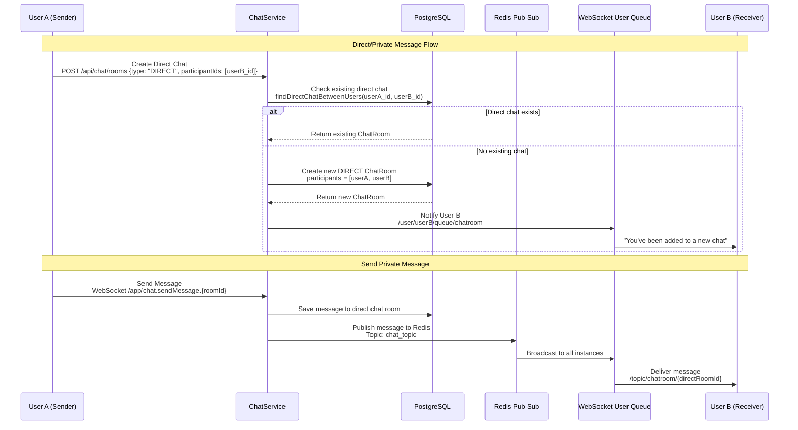

# Private Messaging & User Tracking Guide

## 📋 Table of Contents

- [Private Messaging Implementation](#private-messaging-implementation)
- [User Connection Tracking](#user-connection-tracking)
- [Direct Message Delivery System](#direct-message-delivery-system)
- [Phase Comparison: Basic vs Advanced Features](#phase-comparison-basic-vs-advanced-features)
- [Iterative Development: Phase 1 vs Phase 2](#iterative-development-phase-1-vs-phase-2)
- [Migration Path: From Group to Private Messaging](#migration-path-from-group-to-private-messaging)

## 🔐 Private Messaging Implementation

### Core Architecture for Individual User Messaging

The chat application implements private messaging through **two primary mechanisms**:

#### 1. **Direct Chat Rooms** (Database-Persistent Private Messages)

```java
// ChatRoomType.java - Defines chat room types
public enum ChatRoomType {
    DIRECT,  // One-to-one chat between two users
    GROUP    // Group chat with multiple users
}
```

#### 2. **User-Specific WebSocket Queues** (Real-time Notifications & System Messages)

```java
// WebSocket configuration enables user-specific destinations
config.setUserDestinationPrefix("/user");  // Enables /user/{username}/queue/* destinations
```

### Private Message Flow Architecture



### Key Classes Handling Private Messages

#### **1. ChatService.java** - Direct Chat Management

```java
@Service
public class ChatService {

    // Creates or retrieves existing direct chat between two users
    @Transactional
    public ChatRoomResponse createChatRoom(CreateChatRoomRequest request) {
        ChatRoomType roomType = ChatRoomType.valueOf(request.getType());

        // For direct chats, ensure only 2 participants
        if (roomType == ChatRoomType.DIRECT) {
            if (request.getParticipantIds().size() != 1) {
                throw new RuntimeException("Direct chat must have exactly one other participant");
            }

            Long otherUserId = request.getParticipantIds().get(0);

            // Check if direct chat already exists between these users
            var existingChat = chatRoomRepository.findDirectChatBetweenUsers(
                    currentUser.getId(), otherUserId);

            if (existingChat.isPresent()) {
                return mapToChatRoomResponse(existingChat.get(), currentUser);
            }
        }

        // Create new direct chat with auto-generated name
        String chatName = roomType == ChatRoomType.DIRECT
            ? generateDirectChatName(currentUser, participants)
            : request.getName();

        ChatRoom chatRoom = ChatRoom.builder()
                .name(chatName)
                .type(roomType)
                .createdBy(currentUser)
                .participants(new HashSet<>(participants))
                .build();

        chatRoom = chatRoomRepository.save(chatRoom);

        // Notify participants about new chat room via private queue
        notifyParticipantsAboutNewChatRoom(chatRoom, currentUser);

        return mapToChatRoomResponse(chatRoom, currentUser);
    }

    // Private method to notify users via individual queues
    private void notifyParticipantsAboutNewChatRoom(ChatRoom chatRoom, User creator) {
        ChatRoomResponse chatRoomResponse = mapToChatRoomResponse(chatRoom, creator);

        for (User participant : chatRoom.getParticipants()) {
            if (!participant.getId().equals(creator.getId())) {
                // Send private notification to each participant
                String destination = "/user/" + participant.getUsername() + "/queue/chatroom";
                messagingTemplate.convertAndSend(destination, chatRoomResponse);
            }
        }
    }
}
```

#### **2. ChatRoomRepository.java** - Direct Chat Queries

```java
@Repository
public interface ChatRoomRepository extends JpaRepository<ChatRoom, Long> {

    /**
     * Find existing direct chat between two users
     * Prevents duplicate direct chats between same participants
     */
    @Query("SELECT cr FROM ChatRoom cr JOIN cr.participants p1 JOIN cr.participants p2 " +
           "WHERE cr.type = 'DIRECT' AND p1.id = :userId1 AND p2.id = :userId2 AND cr.isActive = true")
    Optional<ChatRoom> findDirectChatBetweenUsers(@Param("userId1") Long userId1, @Param("userId2") Long userId2);

    /**
     * Find all chat rooms where user is a participant
     */
    @Query("SELECT cr FROM ChatRoom cr JOIN cr.participants p WHERE p.id = :userId AND cr.isActive = true")
    Page<ChatRoom> findActiveRoomsByUserId(@Param("userId") Long userId, Pageable pageable);
}
```

#### **3. WebSocketChatController.java** - Private Error Handling

```java
@Controller
public class WebSocketChatController {

    @MessageMapping("/chat.sendMessage.{roomId}")
    public void sendMessageToRoom(@DestinationVariable String roomId,
                                 @Payload SendMessageRequest messageRequest,
                                 Principal principal) {
        try {
            // Process message normally...
            MessageResponse response = chatService.sendMessage(messageRequest);

            // Broadcast to room (works for both direct and group chats)
            String destination = "/topic/chatroom/" + roomId;
            messagingTemplate.convertAndSend(destination, response);

        } catch (Exception e) {
            // Send error back to individual user's private queue
            String errorDestination = "/user/" + principal.getName() + "/queue/errors";
            messagingTemplate.convertAndSend(errorDestination,
                    "Failed to send message: " + e.getMessage());
        }
    }
}
```

## 👥 User Connection Tracking

### Connected Users Management System

The application tracks connected users through **multiple layers**:

#### **1. Database-Level Status Tracking** (User.java)

```java
@Entity
public class User implements UserDetails {

    @Builder.Default
    private Boolean isOnline = false;

    @Column(name = "last_seen")
    private LocalDateTime lastSeen;

    // Updates online status and last seen timestamp
    public void updateOnlineStatus(boolean isOnline) {
        this.isOnline = isOnline;
        if (!isOnline) {
            this.lastSeen = LocalDateTime.now();
        }
    }
}
```

#### **2. WebSocket Session Management** (WebSocketEventListener.java)

```java
@Component
public class WebSocketEventListener {

    private final UserService userService;
    private final SimpMessageSendingOperations messagingTemplate;

    @EventListener
    public void handleWebSocketConnectListener(SessionConnectedEvent event) {
        log.info("WebSocket connection established");
        // User status updated via JWT authentication in WebSocketConfig
    }

    @EventListener
    public void handleWebSocketDisconnectListener(SessionDisconnectEvent event) {
        StompHeaderAccessor headerAccessor = StompHeaderAccessor.wrap(event.getMessage());

        String username = (String) headerAccessor.getSessionAttributes().get("username");
        if (username != null) {
            // Update database status
            userService.updateOnlineStatus(username, false);

            // Broadcast disconnection to public topic
            UserLeaveEvent leaveEvent = new UserLeaveEvent();
            leaveEvent.setUsername(username);
            leaveEvent.setType("LEAVE");

            messagingTemplate.convertAndSend("/topic/public", leaveEvent);
        }
    }
}
```

#### **3. Real-time Status Broadcasting** (UserService.java)

```java
@Service
public class UserService {

    @Transactional
    public void updateOnlineStatus(String username, boolean isOnline) {
        User user = userRepository.findByUsername(username)
                .orElseThrow(() -> new RuntimeException("User not found"));

        user.updateOnlineStatus(isOnline);
        userRepository.save(user);

        // Could integrate with RedisMessagePublisher for cross-instance status sync
        // redisMessagePublisher.publishUserStatus(username, isOnline);
    }

    public List<UserResponse> getOnlineUsers() {
        List<User> onlineUsers = userRepository.findByIsOnlineTrue();
        return onlineUsers.stream()
                .map(this::mapToUserResponse)
                .collect(Collectors.toList());
    }
}
```

#### **4. Cross-Instance Status Synchronization** (RedisMessagePublisher.java)

```java
@Service
public class RedisMessagePublisher {

    // Publishes user status changes across all application instances
    public void publishUserStatus(String username, boolean isOnline) {
        try {
            UserStatusMessage statusMessage = new UserStatusMessage(username, isOnline);
            String messageJson = objectMapper.writeValueAsString(statusMessage);
            redisTemplate.convertAndSend(RedisConfig.USER_STATUS_TOPIC, messageJson);
        } catch (Exception e) {
            log.error("Failed to publish user status to Redis", e);
        }
    }

    public static class UserStatusMessage {
        private String username;
        private boolean isOnline;
        private long timestamp;

        // Constructor, getters, setters...
    }
}
```

### User Status Tracking Flow

```
┌─────────────────┐    ┌──────────────────────┐    ┌─────────────────────┐
│ WebSocket       │    │ UserService          │    │ Database            │
│ Connection      │    │ updateOnlineStatus() │    │ users.is_online     │
│                 │    │                      │    │ users.last_seen     │
│ ✅ Connect      │───▶│ setOnline(true)      │───▶│ is_online = true    │
│ ❌ Disconnect   │───▶│ setOnline(false)     │───▶│ is_online = false   │
│                 │    │                      │    │ last_seen = now()   │
└─────────────────┘    └──────────────────────┘    └─────────────────────┘
                                  │
                                  ▼
                       ┌──────────────────────┐
                       │ Redis Pub-Sub        │
                       │ USER_STATUS_TOPIC    │
                       │                      │
                       │ Cross-instance       │
                       │ Status Sync          │
                       └──────────────────────┘
                                  │
                                  ▼
                       ┌──────────────────────┐
                       │ WebSocket Broadcast  │
                       │ /topic/user-status   │
                       │                      │
                       │ Real-time Updates    │
                       │ to All Clients       │
                       └──────────────────────┘
```

## 📡 Direct Message Delivery System

### Private Message Delivery Mechanisms

#### **1. User-Specific Queues** (System Notifications)

```javascript
// Client-side subscription to private user queue
stompClient.subscribe("/user/queue/errors", function (errorMessage) {
  console.error("Private error:", errorMessage.body);
});

stompClient.subscribe("/user/queue/chatroom", function (notification) {
  const chatData = JSON.parse(notification.body);
  showNewChatNotification(chatData);
});
```

#### **2. Direct Chat Room Topics** (Persistent Messages)

```javascript
// Subscribe to direct chat room (same as group, but with 2 participants)
stompClient.subscribe("/topic/chatroom/456", function (message) {
  const messageData = JSON.parse(message.body);
  if (isDirectChat(messageData.chatRoomId)) {
    displayPrivateMessage(messageData);
  } else {
    displayGroupMessage(messageData);
  }
});
```

### WebSocket Destination Patterns

| Destination Pattern               | Purpose                       | Message Type                  | Delivery    |
| --------------------------------- | ----------------------------- | ----------------------------- | ----------- |
| `/user/{username}/queue/errors`   | **Private Error Messages**    | Error notifications           | One-to-one  |
| `/user/{username}/queue/chatroom` | **Chat Invitations**          | New chat notifications        | One-to-one  |
| `/user/{username}/queue/typing`   | **Private Typing Indicators** | Typing status                 | One-to-one  |
| `/topic/chatroom/{roomId}`        | **Direct Messages**           | Chat messages in DIRECT rooms | One-to-one  |
| `/topic/chatroom/{roomId}`        | **Group Messages**            | Chat messages in GROUP rooms  | One-to-many |
| `/topic/public`                   | **System Broadcasts**         | Global announcements          | Broadcast   |

### Direct vs Group Message Identification

```java
// In ChatRoomResponse.java - DTO includes room type information
@Data
@Builder
public class ChatRoomResponse {
    private Long id;
    private String name;
    private String type;  // "DIRECT" or "GROUP"
    private List<ParticipantInfo> participants;

    // Client can identify direct chats by:
    // 1. type === "DIRECT"
    // 2. participants.length === 2
    // 3. Auto-generated name pattern "User A & User B"
}
```

### Frontend Direct Message Handling

```javascript
class PrivateMessagingClient {
  constructor(jwtToken) {
    this.jwtToken = jwtToken;
    this.directChats = new Map(); // roomId -> otherUser info
  }

  // Create or get existing direct chat
  async startDirectChat(otherUserId) {
    const response = await fetch("/api/chat/rooms", {
      method: "POST",
      headers: {
        Authorization: "Bearer " + this.jwtToken,
        "Content-Type": "application/json",
      },
      body: JSON.stringify({
        type: "DIRECT",
        participantIds: [otherUserId],
      }),
    });

    const chatRoom = await response.json();

    if (chatRoom.type === "DIRECT") {
      // Subscribe to direct chat room
      this.stompClient.subscribe(
        `/topic/chatroom/${chatRoom.id}`,
        (message) => {
          this.handleDirectMessage(JSON.parse(message.body));
        }
      );

      // Store direct chat info
      const otherUser = chatRoom.participants.find(
        (p) => p.id !== this.currentUserId
      );
      this.directChats.set(chatRoom.id, otherUser);
    }

    return chatRoom;
  }

  handleDirectMessage(message) {
    const otherUser = this.directChats.get(message.chatRoomId);

    // Display as private message with special UI
    this.displayPrivateMessage({
      ...message,
      isPrivate: true,
      otherUser: otherUser,
    });
  }

  sendDirectMessage(chatRoomId, content) {
    this.stompClient.send(
      `/app/chat.sendMessage.${chatRoomId}`,
      {},
      JSON.stringify({
        chat_room_id: chatRoomId,
        content: content,
        type: "TEXT",
      })
    );
  }
}
```

## 📊 Phase Comparison: Basic vs Advanced Features

### Phase 1: Basic Group Messaging Features

```
✅ **Implemented in Phase 1:**
├── Group chat room creation
├── Real-time group message broadcasting
├── WebSocket connection management
├── JWT authentication for WebSockets
├── Redis pub-sub for multi-instance scaling
├── Message persistence to PostgreSQL
├── Basic user online/offline status
├── Group chat participant management
├── Message history retrieval
└── Error handling via user queues
```

### Phase 2: Advanced Private Messaging Features

```
✅ **Added in Phase 2:**
├── Direct chat room creation (DIRECT vs GROUP types)
├── Private message delivery via user-specific queues
├── Automatic direct chat deduplication
├── Enhanced user presence tracking
├── Cross-instance user status synchronization
├── Private error message delivery
├── Chat invitation notifications
├── Auto-generated direct chat naming
├── Direct chat participant validation (exactly 2 users)
└── Enhanced user discovery and search
```

### Feature Comparison Matrix

| Feature                | Phase 1 (Basic)       | Phase 2 (Advanced)                   |
| ---------------------- | --------------------- | ------------------------------------ |
| **Message Types**      | Group messages only   | Group + Direct messages              |
| **Chat Room Types**    | GROUP only            | GROUP + DIRECT                       |
| **User Queues**        | Error messages only   | Errors + Invitations + Notifications |
| **Status Tracking**    | Basic online/offline  | Enhanced presence + last seen        |
| **Chat Creation**      | Manual group creation | Auto direct chat + manual groups     |
| **Participant Limits** | 2+ users (groups)     | Exactly 2 (direct) or 2+ (groups)    |
| **Chat Naming**        | User-defined names    | Auto-generated for direct chats      |
| **Message Delivery**   | Broadcast to topics   | Broadcast + Private queues           |
| **User Discovery**     | Basic user list       | Advanced search + online users       |

## 🔄 Iterative Development: Phase 1 vs Phase 2

### Phase 1 Implementation (Basic Group Messaging)

#### **Core Files - Phase 1**

```
📁 Phase 1 Essential Files:
├── config/
│   ├── WebSocketConfig.java ⭐ (Basic WebSocket setup)
│   ├── SecurityConfig.java ⭐ (JWT authentication)
│   └── RedisConfig.java ⭐ (Basic pub-sub)
├── model/
│   ├── User.java ⭐ (Basic user + UserDetails)
│   ├── ChatRoom.java ⭐ (GROUP type only)
│   └── Message.java ⭐ (Basic message storage)
├── repository/
│   ├── UserRepository.java ⭐ (Basic user queries)
│   ├── ChatRoomRepository.java ⭐ (Basic chat queries)
│   └── MessageRepository.java ⭐ (Message storage/retrieval)
├── service/
│   ├── ChatService.java ⭐ (Group chat only)
│   └── UserService.java ⭐ (Basic user management)
├── controller/
│   └── WebSocketChatController.java ⭐ (Group messaging)
├── dto/
│   ├── SendMessageRequest.java ⭐ (Message input)
│   └── MessageResponse.java ⭐ (Message output)
└── Redis/
    ├── RedisMessagePublisher.java ⭐ (Basic chat pub-sub)
    └── RedisMessageSubscriber.java ⭐ (Message reception)
```

#### **Phase 1 Key Methods**

```java
// ChatService.java - Phase 1 Methods
public class ChatService {
    public ChatRoomResponse createChatRoom(CreateChatRoomRequest request) {
        // Basic group chat creation only
        // No DIRECT type handling
        // No duplicate prevention
    }

    public MessageResponse sendMessage(SendMessageRequest request) {
        // Basic message sending to group chats
        // No private queue notifications
    }
}

// WebSocketChatController.java - Phase 1 Methods
public class WebSocketChatController {
    @MessageMapping("/chat.sendMessage.{roomId}")
    public void sendMessageToRoom(...) {
        // Basic room broadcasting
        // Error messages to private queue (minimal)
    }
}

// UserService.java - Phase 1 Methods
public class UserService {
    public void updateOnlineStatus(String username, boolean isOnline) {
        // Basic status update, no broadcasting
    }
}
```

### Phase 2 Enhancements (Advanced Private Messaging)

#### **New Files Added in Phase 2**

```
📁 New Files in Phase 2:
├── model/
│   └── ChatRoomType.java ⭐ (DIRECT vs GROUP enum)
├── config/
│   └── WebSocketEventListener.java ⭐ (Connection tracking)
└── Enhanced existing files with new methods
```

#### **Modified Files in Phase 2**

##### **1. ChatRoomRepository.java** - New Query Methods

```java
// 🆕 Phase 2 Additions
@Repository
public interface ChatRoomRepository extends JpaRepository<ChatRoom, Long> {

    // 🆕 NEW: Find existing direct chat between users
    @Query("SELECT cr FROM ChatRoom cr JOIN cr.participants p1 JOIN cr.participants p2 " +
           "WHERE cr.type = 'DIRECT' AND p1.id = :userId1 AND p2.id = :userId2 AND cr.isActive = true")
    Optional<ChatRoom> findDirectChatBetweenUsers(@Param("userId1") Long userId1, @Param("userId2") Long userId2);

    // 🆕 NEW: Find group chats created by user
    @Query("SELECT cr FROM ChatRoom cr WHERE cr.createdBy.id = :userId AND cr.type = 'GROUP' AND cr.isActive = true")
    List<ChatRoom> findGroupChatsByCreator(@Param("userId") Long userId);
}
```

##### **2. ChatService.java** - Enhanced Methods

```java
// 🔄 Phase 2 Enhancements
public class ChatService {

    // 🔄 ENHANCED: Now handles both DIRECT and GROUP types
    @Transactional
    public ChatRoomResponse createChatRoom(CreateChatRoomRequest request) {
        ChatRoomType roomType = ChatRoomType.valueOf(request.getType());

        // 🆕 NEW: Direct chat validation and deduplication
        if (roomType == ChatRoomType.DIRECT) {
            if (request.getParticipantIds().size() != 1) {
                throw new RuntimeException("Direct chat must have exactly one other participant");
            }

            // 🆕 NEW: Check for existing direct chat
            var existingChat = chatRoomRepository.findDirectChatBetweenUsers(
                    currentUser.getId(), otherUserId);

            if (existingChat.isPresent()) {
                return mapToChatRoomResponse(existingChat.get(), currentUser);
            }
        }

        // 🆕 NEW: Auto-generated naming for direct chats
        String chatName = roomType == ChatRoomType.DIRECT
            ? generateDirectChatName(currentUser, participants)
            : request.getName();

        // 🆕 NEW: Private queue notifications
        notifyParticipantsAboutNewChatRoom(chatRoom, currentUser);
    }

    // 🆕 NEW: Private notification method
    private void notifyParticipantsAboutNewChatRoom(ChatRoom chatRoom, User creator) {
        for (User participant : chatRoom.getParticipants()) {
            if (!participant.getId().equals(creator.getId())) {
                String destination = "/user/" + participant.getUsername() + "/queue/chatroom";
                messagingTemplate.convertAndSend(destination, chatRoomResponse);
            }
        }
    }

    // 🆕 NEW: Direct chat name generation
    private String generateDirectChatName(User currentUser, List<User> participants) {
        User otherUser = participants.stream()
                .filter(p -> !p.getId().equals(currentUser.getId()))
                .findFirst()
                .orElse(currentUser);
        return currentUser.getFullName() + " & " + otherUser.getFullName();
    }
}
```

##### **3. UserService.java** - Enhanced Status Management

```java
// 🔄 Phase 2 Enhancements
public class UserService {

    // 🔄 ENHANCED: Now includes Redis broadcasting
    @Transactional
    public void updateOnlineStatus(String username, boolean isOnline) {
        User user = userRepository.findByUsername(username)
                .orElseThrow(() -> new RuntimeException("User not found"));

        user.updateOnlineStatus(isOnline);
        userRepository.save(user);

        // 🆕 NEW: Cross-instance status broadcasting
        redisMessagePublisher.publishUserStatus(username, isOnline);
    }

    // 🆕 NEW: Get online users list
    public List<UserResponse> getOnlineUsers() {
        List<User> onlineUsers = userRepository.findByIsOnlineTrue();
        return onlineUsers.stream()
                .map(this::mapToUserResponse)
                .collect(Collectors.toList());
    }
}
```

##### **4. RedisMessagePublisher.java** - User Status Broadcasting

```java
// 🔄 Phase 2 Enhancements
public class RedisMessagePublisher {

    // 🆕 NEW: User status broadcasting
    public void publishUserStatus(String username, boolean isOnline) {
        try {
            UserStatusMessage statusMessage = new UserStatusMessage(username, isOnline);
            String messageJson = objectMapper.writeValueAsString(statusMessage);
            redisTemplate.convertAndSend(RedisConfig.USER_STATUS_TOPIC, messageJson);
        } catch (Exception e) {
            log.error("Failed to publish user status to Redis", e);
        }
    }

    // 🆕 NEW: User status message DTO
    public static class UserStatusMessage {
        private String username;
        private boolean isOnline;
        private long timestamp;
        // Constructor, getters, setters...
    }
}
```

##### **5. WebSocketConfig.java** - Enhanced Authentication

```java
// 🔄 Phase 2 Enhancements
public class WebSocketConfig implements WebSocketMessageBrokerConfigurer {

    @Override
    public void configureClientInboundChannel(ChannelRegistration registration) {
        registration.interceptors(new ChannelInterceptor() {
            @Override
            public Message<?> preSend(Message<?> message, MessageChannel channel) {
                StompHeaderAccessor accessor = MessageHeaderAccessor.getAccessor(message, StompHeaderAccessor.class);

                if (StompCommand.CONNECT.equals(accessor.getCommand())) {
                    // JWT authentication logic...

                    // 🆕 NEW: Store username in session for disconnect tracking
                    accessor.getSessionAttributes().put("username", username);

                    // 🆕 NEW: Update user online status on connect
                    userService.updateOnlineStatus(username, true);
                }
                return message;
            }
        });
    }
}
```

## 🚀 Migration Path: From Group to Private Messaging

### Step-by-Step Migration Guide

#### **Step 1: Add ChatRoomType Enum**

```java
// 🆕 NEW FILE: ChatRoomType.java
public enum ChatRoomType {
    DIRECT,  // Private one-to-one chats
    GROUP    // Multi-participant group chats
}
```

#### **Step 2: Update ChatRoom Entity**

```java
// 🔄 MODIFY: ChatRoom.java
@Entity
public class ChatRoom {
    // Add type field
    @Enumerated(EnumType.STRING)
    @Column(nullable = false)
    private ChatRoomType type;  // 🆕 NEW

    // 🆕 NEW: Helper methods
    public boolean isDirectChat() {
        return type == ChatRoomType.DIRECT && participants.size() == 2;
    }

    public boolean isGroupChat() {
        return type == ChatRoomType.GROUP;
    }
}
```

#### **Step 3: Enhance Repository Queries**

```java
// 🔄 MODIFY: ChatRoomRepository.java
@Repository
public interface ChatRoomRepository extends JpaRepository<ChatRoom, Long> {

    // 🆕 ADD: Direct chat finding
    @Query("SELECT cr FROM ChatRoom cr JOIN cr.participants p1 JOIN cr.participants p2 " +
           "WHERE cr.type = 'DIRECT' AND p1.id = :userId1 AND p2.id = :userId2 AND cr.isActive = true")
    Optional<ChatRoom> findDirectChatBetweenUsers(@Param("userId1") Long userId1, @Param("userId2") Long userId2);
}
```

#### **Step 4: Update ChatService Logic**

```java
// 🔄 MODIFY: ChatService.java
public class ChatService {

    public ChatRoomResponse createChatRoom(CreateChatRoomRequest request) {
        // 🆕 ADD: Type-specific logic
        ChatRoomType roomType = ChatRoomType.valueOf(request.getType());

        if (roomType == ChatRoomType.DIRECT) {
            // Direct chat validation and deduplication
        } else {
            // Group chat logic (existing)
        }
    }
}
```

#### **Step 5: Add WebSocket Event Listener**

```java
// 🆕 NEW FILE: WebSocketEventListener.java
@Component
public class WebSocketEventListener {

    @EventListener
    public void handleWebSocketDisconnectListener(SessionDisconnectEvent event) {
        // Update user offline status
        // Broadcast user leave event
    }
}
```

#### **Step 6: Enhance User Status Management**

```java
// 🔄 MODIFY: UserService.java
public class UserService {

    // Add Redis broadcasting to existing method
    public void updateOnlineStatus(String username, boolean isOnline) {
        // Existing database update logic
        // 🆕 ADD: Redis broadcasting
        redisMessagePublisher.publishUserStatus(username, isOnline);
    }
}
```

#### **Step 7: Add Private Queue Support**

```java
// 🔄 MODIFY: ChatService.java
private void notifyParticipantsAboutNewChatRoom(ChatRoom chatRoom, User creator) {
    // 🆕 NEW: Private queue notifications
    for (User participant : chatRoom.getParticipants()) {
        if (!participant.getId().equals(creator.getId())) {
            String destination = "/user/" + participant.getUsername() + "/queue/chatroom";
            messagingTemplate.convertAndSend(destination, chatRoomResponse);
        }
    }
}
```

### Database Migration Script

```sql
-- 🆕 Add type column to existing chat_rooms table
ALTER TABLE chat_rooms ADD COLUMN type VARCHAR(10) NOT NULL DEFAULT 'GROUP';

-- 🆕 Update existing rooms to GROUP type
UPDATE chat_rooms SET type = 'GROUP' WHERE type IS NULL OR type = '';

-- 🆕 Add index for better direct chat queries
CREATE INDEX idx_chat_rooms_type_active ON chat_rooms(type, is_active);

-- 🆕 Add constraint to ensure type is valid
ALTER TABLE chat_rooms ADD CONSTRAINT chk_chat_room_type
    CHECK (type IN ('DIRECT', 'GROUP'));
```

### Frontend Migration

```javascript
// 🔄 Update existing chat client
class ChatClient {
  // 🆕 NEW: Create direct chat
  async startDirectChat(otherUserId) {
    return await this.createChatRoom({
      type: "DIRECT",
      participantIds: [otherUserId],
    });
  }

  // 🔄 ENHANCE: Subscribe to private queues
  onConnected() {
    // Existing subscriptions...

    // 🆕 NEW: Private queues
    this.stompClient.subscribe("/user/queue/chatroom", (notification) => {
      this.handleChatInvitation(JSON.parse(notification.body));
    });

    this.stompClient.subscribe("/user/queue/errors", (error) => {
      this.handlePrivateError(error.body);
    });
  }

  // 🆕 NEW: Handle chat type differences
  displayMessage(message) {
    const chatType = this.getChatType(message.chatRoomId);

    if (chatType === "DIRECT") {
      this.displayPrivateMessage(message);
    } else {
      this.displayGroupMessage(message);
    }
  }
}
```

This comprehensive migration path allows you to incrementally upgrade from basic group messaging (Phase 1) to advanced private messaging capabilities (Phase 2) while maintaining backward compatibility and system stability.
