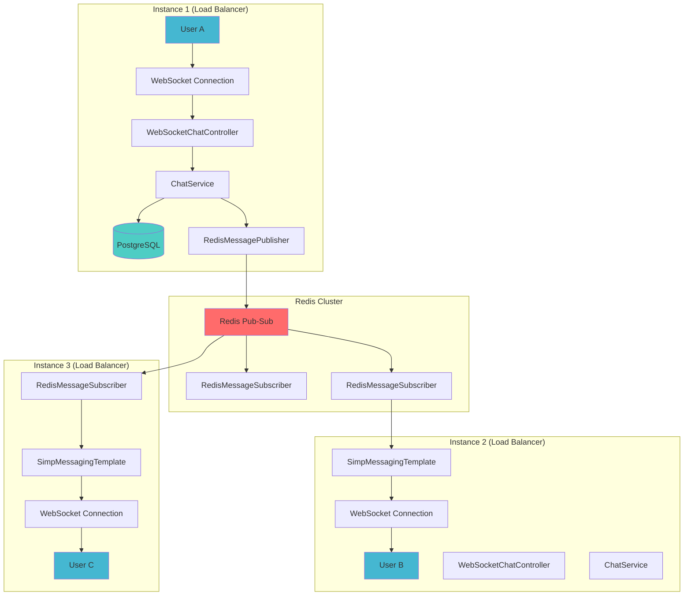
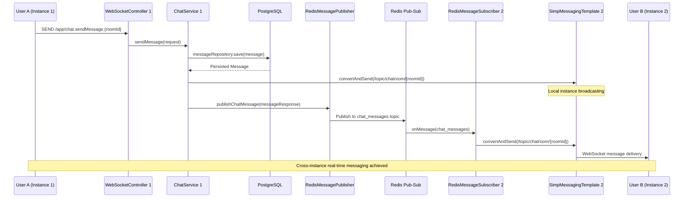

# Message Routing & Cross-Instance Communication Guide

## 📋 Table of Contents

- [Current Architecture: Redis Pub-Sub Integration](#current-architecture-redis-pub-sub-integration)
- [Message Routing Across Multiple Instances](#message-routing-across-multiple-instances)
- [Kafka Integration Analysis](#kafka-integration-analysis)
- [Phase Evolution: From Basic to Advanced Messaging](#phase-evolution-from-basic-to-advanced-messaging)
- [Phase 3 vs Phase 4: Complete Architecture Comparison](#phase-3-vs-phase-4-complete-architecture-comparison)
- [Migration Path: Redis to Kafka Transition](#migration-path-redis-to-kafka-transition)

## 🔴 Current Architecture: Redis Pub-Sub Integration

### Core Redis Components Identified

The chat application currently uses **Redis pub-sub** for cross-instance communication with the following key components:

#### **1. RedisConfig.java** - Central Redis Configuration

```java
@Configuration
@ConditionalOnProperty(name = "messaging.type", havingValue = "redis", matchIfMissing = true)
public class RedisConfig {

    // Topic constants for message routing
    public static final String CHAT_TOPIC = "chat_messages";
    public static final String USER_STATUS_TOPIC = "user_status";

    @Bean
    public RedisTemplate<String, Object> redisTemplate(RedisConnectionFactory connectionFactory) {
        RedisTemplate<String, Object> template = new RedisTemplate<>();
        template.setConnectionFactory(connectionFactory);

        // JSON serialization for complex objects
        template.setKeySerializer(new StringRedisSerializer());
        template.setValueSerializer(new Jackson2JsonRedisSerializer<>(Object.class));

        return template;
    }

    @Bean
    public ChannelTopic chatTopic() {
        return new ChannelTopic(CHAT_TOPIC);
    }

    @Bean
    public ChannelTopic userStatusTopic() {
        return new ChannelTopic(USER_STATUS_TOPIC);
    }

    @Bean
    public RedisMessageListenerContainer redisContainer(
            RedisConnectionFactory connectionFactory,
            MessageListenerAdapter listenerAdapter) {

        RedisMessageListenerContainer container = new RedisMessageListenerContainer();
        container.setConnectionFactory(connectionFactory);

        // Subscribe to both chat and user status topics
        container.addMessageListener(listenerAdapter, chatTopic());
        container.addMessageListener(listenerAdapter, userStatusTopic());

        return container;
    }
}
```

**Key Features:**

- **Conditional Configuration**: Only activates when `messaging.type=redis`
- **Dual Topics**: Separate channels for chat messages and user status
- **JSON Serialization**: Complex object support via Jackson
- **Message Listener Container**: Automatic subscription management

#### **2. RedisMessagePublisher.java** - Message Broadcasting Service

```java
@Service
@RequiredArgsConstructor
@Slf4j
@ConditionalOnProperty(name = "messaging.type", havingValue = "redis", matchIfMissing = true)
public class RedisMessagePublisher {

    private final RedisTemplate<String, Object> redisTemplate;
    private final ObjectMapper objectMapper;

    /**
     * Publishes chat messages to Redis for cross-instance broadcasting
     */
    public void publishChatMessage(MessageResponse message) {
        try {
            String messageJson = objectMapper.writeValueAsString(message);
            redisTemplate.convertAndSend(RedisConfig.CHAT_TOPIC, messageJson);

            log.debug("Published chat message to Redis: {}", message.getId());
        } catch (Exception e) {
            log.error("Failed to publish chat message to Redis", e);
        }
    }

    /**
     * Publishes user status changes for real-time presence updates
     */
    public void publishUserStatus(String username, boolean isOnline) {
        try {
            UserStatusMessage statusMessage = new UserStatusMessage(username, isOnline);
            String messageJson = objectMapper.writeValueAsString(statusMessage);
            redisTemplate.convertAndSend(RedisConfig.USER_STATUS_TOPIC, messageJson);

            log.debug("Published user status to Redis: {} - {}", username, isOnline);
        } catch (Exception e) {
            log.error("Failed to publish user status to Redis", e);
        }
    }

    /**
     * DTO for user status messages
     */
    public static class UserStatusMessage {
        private String username;
        private boolean isOnline;
        private long timestamp;

        public UserStatusMessage(String username, boolean isOnline) {
            this.username = username;
            this.isOnline = isOnline;
            this.timestamp = System.currentTimeMillis();
        }

        // Getters and setters...
    }
}
```

**Core Functions:**

- **Chat Message Broadcasting**: Distributes `MessageResponse` objects across instances
- **User Status Synchronization**: Real-time presence updates
- **Error Resilience**: Graceful failure handling without breaking chat functionality
- **JSON Serialization**: Consistent message format across instances

#### **3. RedisMessageSubscriber.java** - Message Reception & Distribution

```java
@Component
@RequiredArgsConstructor
@Slf4j
public class RedisMessageSubscriber implements MessageListener {

    private final SimpMessagingTemplate messagingTemplate;
    private final ObjectMapper objectMapper;

    @Override
    public void onMessage(Message message, byte[] pattern) {
        try {
            String channel = new String(message.getChannel());
            String messageBody = new String(message.getBody());

            log.debug("Received Redis message on channel: {}", channel);

            if (RedisConfig.CHAT_TOPIC.equals(channel)) {
                handleChatMessage(messageBody);
            } else if (RedisConfig.USER_STATUS_TOPIC.equals(channel)) {
                handleUserStatusMessage(messageBody);
            }
        } catch (Exception e) {
            log.error("Failed to process Redis message", e);
        }
    }

    private void handleChatMessage(String messageBody) {
        try {
            MessageResponse messageResponse = objectMapper.readValue(messageBody, MessageResponse.class);

            // Broadcast to WebSocket clients
            String destination = "/topic/chatroom/" + messageResponse.getChatRoomId();
            messagingTemplate.convertAndSend(destination, messageResponse);

            log.debug("Chat message broadcasted to: {}", destination);
        } catch (Exception e) {
            log.error("Failed to handle chat message", e);
        }
    }

    private void handleUserStatusMessage(String messageBody) {
        try {
            // Broadcast user status to all clients
            messagingTemplate.convertAndSend("/topic/user-status", messageBody);

            log.debug("User status message broadcasted");
        } catch (Exception e) {
            log.error("Failed to handle user status message", e);
        }
    }
}
```

**Message Processing:**

- **Channel Routing**: Automatically routes messages based on Redis channel
- **WebSocket Integration**: Converts Redis messages to WebSocket broadcasts
- **Error Isolation**: Failed message processing doesn't affect other messages

## 🌐 Message Routing Across Multiple Instances

### Complete Message Flow Architecture



### Step-by-Step Message Routing Flow

#### **Phase 1: Message Origination**

```java
// User A sends message on Instance 1
// WebSocketChatController.java
@MessageMapping("/chat.sendMessage.{roomId}")
public void sendMessageToRoom(@DestinationVariable String roomId,
                             @Payload SendMessageRequest messageRequest,
                             Principal principal) {

    // 1. Process message through ChatService
    MessageResponse response = chatService.sendMessage(messageRequest);

    // 2. Local WebSocket broadcast (same instance)
    String destination = "/topic/chatroom/" + roomId;
    messagingTemplate.convertAndSend(destination, response);
}
```

#### **Phase 2: Database Persistence**

```java
// ChatService.java
@Transactional
public MessageResponse sendMessage(SendMessageRequest request) {
    // 1. Validate chat room and user permissions
    ChatRoom chatRoom = chatRoomRepository.findById(request.getChatRoomId())
        .orElseThrow(() -> new RuntimeException("Chat room not found"));

    // 2. Create and persist message
    Message message = Message.builder()
        .content(request.getContent())
        .type(MessageType.valueOf(request.getType()))
        .sender(userService.getCurrentUser())
        .chatRoom(chatRoom)
        .timestamp(LocalDateTime.now())
        .build();

    message = messageRepository.save(message);

    // 3. Convert to response DTO
    MessageResponse messageResponse = mapToMessageResponse(message);

    // 4. Real-time local broadcasting
    sendRealTimeMessage(chatRoom, messageResponse);

    return messageResponse;
}

private void sendRealTimeMessage(ChatRoom chatRoom, MessageResponse messageResponse) {
    // Local instance WebSocket broadcasting only
    String destination = "/topic/chatroom/" + chatRoom.getId();
    messagingTemplate.convertAndSend(destination, messageResponse);
}
```

#### **Phase 3: Cross-Instance Broadcasting (Currently Missing)**

**⚠️ Critical Gap Identified:** The current implementation has a significant gap - **Redis publishing is not integrated into ChatService**. This means messages are only broadcast locally within the same instance.

**Expected Integration (Currently Missing):**

```java
// ChatService.java - MISSING INTEGRATION
@Service
@RequiredArgsConstructor
public class ChatService {

    private final RedisMessagePublisher redisMessagePublisher; // ❌ NOT CURRENTLY INJECTED

    private void sendRealTimeMessage(ChatRoom chatRoom, MessageResponse messageResponse) {
        // 1. Local WebSocket broadcast
        String destination = "/topic/chatroom/" + chatRoom.getId();
        messagingTemplate.convertAndSend(destination, messageResponse);

        // 2. Redis cross-instance broadcast (MISSING)
        redisMessagePublisher.publishChatMessage(messageResponse); // ❌ NOT IMPLEMENTED
    }
}
```

#### **Phase 4: Redis Message Distribution**

```java
// RedisMessageSubscriber.java - When properly integrated
private void handleChatMessage(String messageBody) {
    try {
        MessageResponse messageResponse = objectMapper.readValue(messageBody, MessageResponse.class);

        // Broadcast to all WebSocket clients on this instance
        String destination = "/topic/chatroom/" + messageResponse.getChatRoomId();
        messagingTemplate.convertAndSend(destination, messageResponse);

        log.debug("Cross-instance message delivered to: {}", destination);
    } catch (Exception e) {
        log.error("Failed to handle cross-instance message", e);
    }
}
```

### Current vs Intended Architecture

#### **Current Implementation (Single Instance)**

```
User A → WebSocket → ChatService → Database → Local WebSocket → Users on Same Instance
```

#### **Intended Implementation (Multi Instance)**

```
User A (Instance 1) → WebSocket → ChatService → Database → Redis Pub-Sub →
    ├─ Instance 1 → WebSocket → Users on Instance 1
    ├─ Instance 2 → WebSocket → Users on Instance 2
    └─ Instance 3 → WebSocket → Users on Instance 3
```

### Configuration for Multiple Instances

#### **Application Properties for Cross-Instance**

```properties
# ===== REDIS CONFIGURATION =====
spring.data.redis.host=localhost
spring.data.redis.port=6379
spring.data.redis.timeout=60000

# ===== MESSAGING TYPE CONFIGURATION =====
messaging.type=redis  # Enables Redis pub-sub messaging

# ===== LOAD BALANCER CONFIGURATION =====
server.port=8080  # Instance 1
# server.port=8081  # Instance 2
# server.port=8082  # Instance 3
```

## 📨 Kafka Integration Analysis

### Kafka Configuration (Prepared but Not Active)

The application includes Kafka configuration in `application.properties` but it's not currently implemented:

#### **Kafka Properties (Configured but Unused)**

```properties
# ===== KAFKA CONFIGURATION =====
# Note: Currently using Redis pub-sub, Kafka config for future scalability
spring.kafka.bootstrap-servers=localhost:9092
spring.kafka.consumer.group-id=chatapp-group
spring.kafka.consumer.auto-offset-reset=earliest
spring.kafka.consumer.key-deserializer=org.apache.kafka.common.serialization.StringDeserializer
spring.kafka.consumer.value-deserializer=org.apache.kafka.common.serialization.StringDeserializer
spring.kafka.producer.key-serializer=org.apache.kafka.common.serialization.StringSerializer
spring.kafka.producer.value-serializer=org.apache.kafka.common.serialization.StringSerializer
```

### Kafka vs Redis Comparison for Chat Application

| Aspect               | Redis Pub-Sub (Current)  | Kafka (Future)                 |
| -------------------- | ------------------------ | ------------------------------ |
| **Persistence**      | ❌ No persistence        | ✅ Persistent message storage  |
| **Throughput**       | ⚡ Very high (memory)    | ⚡ High (disk + memory)        |
| **Scalability**      | 🔶 Single Redis instance | ✅ Horizontal partitioning     |
| **Message Ordering** | ❌ No guarantees         | ✅ Partition-level ordering    |
| **Message Replay**   | ❌ Not possible          | ✅ Can replay from any offset  |
| **Complexity**       | ✅ Simple setup          | 🔶 More complex                |
| **Use Case**         | ✅ Real-time messaging   | ✅ Event streaming + messaging |
| **Resource Usage**   | 🔶 Memory intensive      | 🔶 Disk + Memory               |

### When to Choose Kafka Over Redis

**Choose Kafka when:**

- ✅ Need message persistence and replay capability
- ✅ Handling high-volume chat applications (100k+ concurrent users)
- ✅ Require exactly-once message delivery
- ✅ Planning to add analytics and message processing
- ✅ Need audit trails for compliance

**Stick with Redis when:**

- ✅ Simple real-time messaging requirements
- ✅ Low to medium traffic (< 10k concurrent users)
- ✅ Simplicity and fast development preferred
- ✅ Memory-based performance is sufficient

## 🔄 Phase Evolution: From Basic to Advanced Messaging

### Phase 1: Single Instance WebSocket Messaging

#### **Phase 1 Architecture**

```
Frontend ↔ WebSocket ↔ Spring Boot ↔ PostgreSQL
```

#### **Phase 1 Core Components**

```java
📁 Phase 1 Files:
├── WebSocketConfig.java           ⭐ Basic WebSocket setup
├── WebSocketChatController.java   ⭐ Local message handling
├── ChatService.java               ⭐ Business logic + local broadcast
├── UserService.java               ⭐ User management
├── Message/ChatRoom/User entities ⭐ JPA persistence
└── MessageRepository.java         ⭐ Database queries
```

#### **Phase 1 WebSocket Flow**

```java
// WebSocketChatController.java - Phase 1
@MessageMapping("/chat.sendMessage")
@SendTo("/topic/public")  // Single topic broadcasting
public MessageResponse sendMessage(@Payload SendMessageRequest messageRequest) {
    MessageResponse response = chatService.sendMessage(messageRequest);
    return response; // Automatic broadcast to /topic/public
}
```

**Limitations:**

- ❌ Single application instance only
- ❌ No cross-instance communication
- ❌ Simple broadcast to all users
- ❌ No user-specific messaging

### Phase 2: Enhanced WebSocket with Private Messaging

#### **Phase 2 Enhancements**

```java
📁 Phase 2 Additions:
├── ChatRoomType.java              🆕 DIRECT vs GROUP rooms
├── Enhanced WebSocketConfig.java  🔄 User-specific destinations
├── Private queue support          🆕 /user/{username}/queue/*
└── Direct chat management         🆕 One-to-one messaging
```

#### **Phase 2 WebSocket Flow**

```java
// WebSocketChatController.java - Phase 2
@MessageMapping("/chat.sendMessage.{roomId}")
public void sendMessageToRoom(@DestinationVariable String roomId,
                             @Payload SendMessageRequest messageRequest) {

    MessageResponse response = chatService.sendMessage(messageRequest);

    // Room-specific broadcasting instead of global
    String destination = "/topic/chatroom/" + roomId;
    messagingTemplate.convertAndSend(destination, response);
}
```

**New Features:**

- ✅ Room-specific message routing
- ✅ Private direct chats (DIRECT room type)
- ✅ User-specific error queues
- ✅ Enhanced user presence tracking

### Phase 3: Redis Pub-Sub for Multi-Instance Scaling

#### **Phase 3 Architecture Addition**

```
Frontend ↔ WebSocket ↔ Spring Boot ↔ Redis Pub-Sub ↔ Multiple Spring Boot Instances
                    ↕
                PostgreSQL
```

#### **Phase 3 New Components**

```java
📁 Phase 3 Additions:
├── RedisConfig.java               🆕 Redis pub-sub configuration
├── RedisMessagePublisher.java    🆕 Cross-instance message publishing
├── RedisMessageSubscriber.java   🆕 Cross-instance message reception
└── Enhanced ChatService.java     🔄 Redis integration (MISSING CURRENTLY)
```

#### **Phase 3 Message Flow (Intended)**

```java
// ChatService.java - Phase 3 (With proper Redis integration)
private void sendRealTimeMessage(ChatRoom chatRoom, MessageResponse messageResponse) {
    // 1. Local WebSocket broadcast (same as Phase 2)
    String destination = "/topic/chatroom/" + chatRoom.getId();
    messagingTemplate.convertAndSend(destination, messageResponse);

    // 2. Redis cross-instance broadcast (Phase 3 addition)
    redisMessagePublisher.publishChatMessage(messageResponse);
}
```

**Current Gap:** Redis components exist but are not integrated into the message flow.

## 🚀 Phase 3 vs Phase 4: Complete Architecture Comparison

### Phase 3: Redis Multi-Instance Messaging (Current Target)

#### **Phase 3 Implementation Requirements**

##### **1. Complete Redis Integration in ChatService**

```java
// ChatService.java - Complete Phase 3 Implementation
@Service
@RequiredArgsConstructor
@Slf4j
public class ChatService {

    private final ChatRoomRepository chatRoomRepository;
    private final MessageRepository messageRepository;
    private final UserService userService;
    private final SimpMessagingTemplate messagingTemplate;
    private final RedisMessagePublisher redisMessagePublisher; // 🆕 MISSING INJECTION

    @Transactional
    public MessageResponse sendMessage(SendMessageRequest request) {
        // 1. Persist message to database
        Message message = createAndSaveMessage(request);

        // 2. Convert to response DTO
        MessageResponse messageResponse = mapToMessageResponse(message);

        // 3. Real-time broadcasting (local + cross-instance)
        sendRealTimeMessage(chatRoom, messageResponse);

        return messageResponse;
    }

    private void sendRealTimeMessage(ChatRoom chatRoom, MessageResponse messageResponse) {
        // Local instance broadcasting
        String destination = "/topic/chatroom/" + chatRoom.getId();
        messagingTemplate.convertAndSend(destination, messageResponse);

        // 🆕 Cross-instance Redis broadcasting
        redisMessagePublisher.publishChatMessage(messageResponse);

        log.debug("Message broadcasted locally and to Redis: {}", messageResponse.getId());
    }
}
```

##### **2. Enhanced User Status Synchronization**

```java
// UserService.java - Phase 3 Enhancement
@Service
@RequiredArgsConstructor
public class UserService {

    private final UserRepository userRepository;
    private final RedisMessagePublisher redisMessagePublisher; // 🆕 MISSING INJECTION

    @Transactional
    public void updateOnlineStatus(String username, boolean isOnline) {
        User user = userRepository.findByUsername(username)
            .orElseThrow(() -> new RuntimeException("User not found"));

        user.updateOnlineStatus(isOnline);
        userRepository.save(user);

        // 🆕 Cross-instance status broadcasting
        redisMessagePublisher.publishUserStatus(username, isOnline);

        log.debug("User status updated and broadcasted: {} - {}", username, isOnline);
    }
}
```

##### **3. WebSocket Event Listener Integration**

```java
// WebSocketEventListener.java - Phase 3 Integration
@Component
@RequiredArgsConstructor
@Slf4j
public class WebSocketEventListener {

    private final UserService userService;
    private final SimpMessagingTemplate messagingTemplate;

    @EventListener
    public void handleWebSocketConnectListener(SessionConnectedEvent event) {
        StompHeaderAccessor headerAccessor = StompHeaderAccessor.wrap(event.getMessage());
        String username = (String) headerAccessor.getSessionAttributes().get("username");

        if (username != null) {
            // This will trigger Redis broadcasting via UserService
            userService.updateOnlineStatus(username, true);
        }
    }

    @EventListener
    public void handleWebSocketDisconnectListener(SessionDisconnectEvent event) {
        StompHeaderAccessor headerAccessor = StompHeaderAccessor.wrap(event.getMessage());
        String username = (String) headerAccessor.getSessionAttributes().get("username");

        if (username != null) {
            // This will trigger Redis broadcasting via UserService
            userService.updateOnlineStatus(username, false);

            // Local broadcast of user leaving
            UserLeaveEvent leaveEvent = new UserLeaveEvent();
            leaveEvent.setUsername(username);
            leaveEvent.setType("LEAVE");

            messagingTemplate.convertAndSend("/topic/public", leaveEvent);
        }
    }
}
```

#### **Phase 3 Message Flow (Complete)**



### Phase 4: Kafka Event Streaming Architecture

#### **Phase 4 Architecture**

```
Frontend ↔ WebSocket ↔ Spring Boot ↔ Kafka Topics ↔ Multiple Spring Boot Instances
                    ↕                        ↕
                PostgreSQL              Analytics/ML Services
```

#### **Phase 4 New Components and Changes**

##### **1. Kafka Configuration Activation**

```java
// KafkaConfig.java - Phase 4 Implementation
@Configuration
@EnableKafka
@ConditionalOnProperty(name = "messaging.type", havingValue = "kafka")
public class KafkaConfig {

    // Topic definitions for different message types
    public static final String CHAT_MESSAGES_TOPIC = "chat-messages";
    public static final String USER_STATUS_TOPIC = "user-status";
    public static final String TYPING_INDICATOR_TOPIC = "typing-indicator";
    public static final String FILE_UPLOAD_TOPIC = "file-uploads";
    public static final String ANALYTICS_TOPIC = "chat-analytics";

    @Bean
    public ProducerFactory<String, String> producerFactory() {
        Map<String, Object> configProps = new HashMap<>();
        configProps.put(ProducerConfig.BOOTSTRAP_SERVERS_CONFIG, bootstrapServers);
        configProps.put(ProducerConfig.KEY_SERIALIZER_CLASS_CONFIG, StringSerializer.class);
        configProps.put(ProducerConfig.VALUE_SERIALIZER_CLASS_CONFIG, StringSerializer.class);

        // Performance optimizations for high-throughput chat
        configProps.put(ProducerConfig.BATCH_SIZE_CONFIG, 16384);
        configProps.put(ProducerConfig.LINGER_MS_CONFIG, 5);
        configProps.put(ProducerConfig.COMPRESSION_TYPE_CONFIG, "snappy");
        configProps.put(ProducerConfig.ACKS_CONFIG, "1");

        return new DefaultKafkaProducerFactory<>(configProps);
    }

    @Bean
    public ConsumerFactory<String, String> consumerFactory() {
        Map<String, Object> props = new HashMap<>();
        props.put(ConsumerConfig.BOOTSTRAP_SERVERS_CONFIG, bootstrapServers);
        props.put(ConsumerConfig.GROUP_ID_CONFIG, groupId);
        props.put(ConsumerConfig.KEY_DESERIALIZER_CLASS_CONFIG, StringDeserializer.class);
        props.put(ConsumerConfig.VALUE_DESERIALIZER_CLASS_CONFIG, StringDeserializer.class);
        props.put(ConsumerConfig.AUTO_OFFSET_RESET_CONFIG, "earliest");

        // High-throughput consumer settings
        props.put(ConsumerConfig.MAX_POLL_RECORDS_CONFIG, 100);
        props.put(ConsumerConfig.FETCH_MIN_BYTES_CONFIG, 1024);

        return new DefaultKafkaConsumerFactory<>(props);
    }

    // Topic creation with partitioning for scalability
    @Bean
    public NewTopic chatMessagesTopic() {
        return TopicBuilder.name(CHAT_MESSAGES_TOPIC)
            .partitions(6)  // 6 partitions for horizontal scaling
            .replicas(3)    // 3 replicas for fault tolerance
            .build();
    }
}
```

##### **2. KafkaMessagePublisher Service**

```java
// KafkaMessagePublisher.java - New Phase 4 Component
@Service
@RequiredArgsConstructor
@Slf4j
@ConditionalOnProperty(name = "messaging.type", havingValue = "kafka")
public class KafkaMessagePublisher {

    private final KafkaTemplate<String, String> kafkaTemplate;
    private final ObjectMapper objectMapper;

    public void publishChatMessage(MessageResponse message) {
        try {
            String messageJson = objectMapper.writeValueAsString(message);
            String key = "chatroom-" + message.getChatRoomId(); // Partition by chat room

            kafkaTemplate.send(KafkaConfig.CHAT_MESSAGES_TOPIC, key, messageJson)
                .addCallback(
                    result -> log.debug("Chat message published to Kafka: {}", message.getId()),
                    failure -> log.error("Failed to publish chat message to Kafka", failure)
                );

        } catch (Exception e) {
            log.error("Failed to serialize message for Kafka", e);
        }
    }

    public void publishUserStatus(String username, boolean isOnline) {
        try {
            UserStatusMessage statusMessage = new UserStatusMessage(username, isOnline);
            String messageJson = objectMapper.writeValueAsString(statusMessage);

            kafkaTemplate.send(KafkaConfig.USER_STATUS_TOPIC, username, messageJson);

        } catch (Exception e) {
            log.error("Failed to publish user status to Kafka", e);
        }
    }

    public void publishFileUpload(FileUploadEvent event) {
        try {
            String eventJson = objectMapper.writeValueAsString(event);
            kafkaTemplate.send(KafkaConfig.FILE_UPLOAD_TOPIC, event.getFileId(), eventJson);

        } catch (Exception e) {
            log.error("Failed to publish file upload event to Kafka", e);
        }
    }

    public void publishAnalyticsEvent(ChatAnalyticsEvent event) {
        try {
            String eventJson = objectMapper.writeValueAsString(event);
            kafkaTemplate.send(KafkaConfig.ANALYTICS_TOPIC, event.getUserId(), eventJson);

        } catch (Exception e) {
            log.error("Failed to publish analytics event to Kafka", e);
        }
    }
}
```

##### **3. KafkaMessageConsumer Service**

```java
// KafkaMessageConsumer.java - New Phase 4 Component
@Component
@RequiredArgsConstructor
@Slf4j
@ConditionalOnProperty(name = "messaging.type", havingValue = "kafka")
public class KafkaMessageConsumer {

    private final SimpMessagingTemplate messagingTemplate;
    private final ObjectMapper objectMapper;

    @KafkaListener(topics = KafkaConfig.CHAT_MESSAGES_TOPIC, groupId = "chatapp-group")
    public void handleChatMessage(ConsumerRecord<String, String> record) {
        try {
            MessageResponse messageResponse = objectMapper.readValue(
                record.value(), MessageResponse.class);

            // Broadcast to WebSocket clients on this instance
            String destination = "/topic/chatroom/" + messageResponse.getChatRoomId();
            messagingTemplate.convertAndSend(destination, messageResponse);

            log.debug("Kafka chat message broadcasted to: {}", destination);

        } catch (Exception e) {
            log.error("Failed to handle Kafka chat message", e);
        }
    }

    @KafkaListener(topics = KafkaConfig.USER_STATUS_TOPIC, groupId = "chatapp-group")
    public void handleUserStatus(ConsumerRecord<String, String> record) {
        try {
            // Broadcast user status to all clients
            messagingTemplate.convertAndSend("/topic/user-status", record.value());

            log.debug("Kafka user status broadcasted");

        } catch (Exception e) {
            log.error("Failed to handle Kafka user status", e);
        }
    }

    @KafkaListener(topics = KafkaConfig.TYPING_INDICATOR_TOPIC, groupId = "chatapp-group")
    public void handleTypingIndicator(ConsumerRecord<String, String> record) {
        try {
            TypingIndicatorEvent event = objectMapper.readValue(
                record.value(), TypingIndicatorEvent.class);

            String destination = "/topic/chatroom/" + event.getChatRoomId() + "/typing";
            messagingTemplate.convertAndSend(destination, event);

        } catch (Exception e) {
            log.error("Failed to handle typing indicator", e);
        }
    }
}
```

##### **4. Enhanced ChatService with Kafka Integration**

```java
// ChatService.java - Phase 4 Enhancement
@Service
@RequiredArgsConstructor
@Slf4j
public class ChatService {

    private final ChatRoomRepository chatRoomRepository;
    private final MessageRepository messageRepository;
    private final UserService userService;
    private final SimpMessagingTemplate messagingTemplate;

    // Conditional injection based on messaging type
    @Autowired(required = false)
    private RedisMessagePublisher redisMessagePublisher;

    @Autowired(required = false)
    private KafkaMessagePublisher kafkaMessagePublisher;

    @Value("${messaging.type:redis}")
    private String messagingType;

    private void sendRealTimeMessage(ChatRoom chatRoom, MessageResponse messageResponse) {
        // Local WebSocket broadcast
        String destination = "/topic/chatroom/" + chatRoom.getId();
        messagingTemplate.convertAndSend(destination, messageResponse);

        // Cross-instance broadcast based on configuration
        if ("kafka".equals(messagingType) && kafkaMessagePublisher != null) {
            kafkaMessagePublisher.publishChatMessage(messageResponse);

            // Additional Kafka-specific events
            publishAnalyticsEvent(messageResponse);

        } else if ("redis".equals(messagingType) && redisMessagePublisher != null) {
            redisMessagePublisher.publishChatMessage(messageResponse);
        }

        log.debug("Message broadcasted via {}: {}", messagingType, messageResponse.getId());
    }

    private void publishAnalyticsEvent(MessageResponse messageResponse) {
        ChatAnalyticsEvent analyticsEvent = ChatAnalyticsEvent.builder()
            .userId(messageResponse.getSender().getId())
            .chatRoomId(messageResponse.getChatRoomId())
            .messageType(messageResponse.getType())
            .timestamp(messageResponse.getTimestamp())
            .build();

        kafkaMessagePublisher.publishAnalyticsEvent(analyticsEvent);
    }
}
```

##### **5. Advanced Event DTOs for Phase 4**

```java
// ChatAnalyticsEvent.java - New Phase 4 DTO
@Data
@Builder
@NoArgsConstructor
@AllArgsConstructor
public class ChatAnalyticsEvent {
    private Long userId;
    private Long chatRoomId;
    private String messageType;
    private LocalDateTime timestamp;
    private String eventType; // MESSAGE_SENT, USER_JOINED, FILE_UPLOADED, etc.
    private Map<String, Object> metadata;
}

// FileUploadEvent.java - New Phase 4 DTO
@Data
@Builder
@NoArgsConstructor
@AllArgsConstructor
public class FileUploadEvent {
    private String fileId;
    private Long userId;
    private Long chatRoomId;
    private String fileName;
    private Long fileSize;
    private String fileType;
    private String uploadStatus; // STARTED, COMPLETED, FAILED
    private LocalDateTime timestamp;
}

// TypingIndicatorEvent.java - New Phase 4 DTO
@Data
@Builder
@NoArgsConstructor
@AllArgsConstructor
public class TypingIndicatorEvent {
    private Long chatRoomId;
    private String username;
    private boolean isTyping;
    private LocalDateTime timestamp;
}
```

#### **Phase 4 Advanced Features**

##### **1. Message Partitioning Strategy**

```java
// Kafka partitioning by chat room for message ordering
public void publishChatMessage(MessageResponse message) {
    String key = "chatroom-" + message.getChatRoomId();
    kafkaTemplate.send(CHAT_MESSAGES_TOPIC, key, messageJson);
    // Messages for same chat room go to same partition → guaranteed ordering
}
```

##### **2. Analytics and ML Integration**

```java
// Separate analytics consumer for machine learning
@KafkaListener(topics = KafkaConfig.ANALYTICS_TOPIC, groupId = "analytics-group")
public void handleAnalyticsEvent(ChatAnalyticsEvent event) {
    // Send to ML services for:
    // - Sentiment analysis
    // - Spam detection
    // - User behavior analysis
    // - Chat activity patterns
}
```

##### **3. File Upload Event Streaming**

```java
// File upload progress via Kafka
@KafkaListener(topics = KafkaConfig.FILE_UPLOAD_TOPIC, groupId = "file-group")
public void handleFileUpload(FileUploadEvent event) {
    // Real-time file upload progress
    // Virus scanning notifications
    // File processing status updates
}
```

### Phase Comparison Summary

| Feature              | Phase 1          | Phase 2          | Phase 3 (Redis)       | Phase 4 (Kafka)             |
| -------------------- | ---------------- | ---------------- | --------------------- | --------------------------- |
| **Architecture**     | Single instance  | Single instance  | Multi-instance        | Multi-instance + Analytics  |
| **Message Types**    | Basic text       | Text + Files     | Text + Files + Status | All + Events + Analytics    |
| **Persistence**      | Database only    | Database only    | Database only         | Database + Event Log        |
| **Cross-Instance**   | ❌ None          | ❌ None          | ✅ Redis Pub-Sub      | ✅ Kafka Streaming          |
| **Message Ordering** | ❌ No guarantees | ❌ No guarantees | ❌ No guarantees      | ✅ Partition-level ordering |
| **Event Replay**     | ❌ Not possible  | ❌ Not possible  | ❌ Not possible       | ✅ Full event replay        |
| **Analytics**        | ❌ None          | ❌ None          | ❌ None               | ✅ Real-time analytics      |
| **Scalability**      | 🔶 Limited       | 🔶 Limited       | ✅ Horizontal         | ✅ Massive horizontal       |
| **Complexity**       | ✅ Simple        | 🔶 Moderate      | 🔶 Moderate           | 🔴 Complex                  |
| **Use Case**         | Development      | Development      | Production            | Enterprise                  |

## 📈 Migration Path: Redis to Kafka Transition

### Migration Strategy: Gradual Transition

#### **Step 1: Implement Missing Redis Integration (Phase 3 Completion)**

```java
// 1. Add RedisMessagePublisher to ChatService
@Service
@RequiredArgsConstructor
public class ChatService {
    private final RedisMessagePublisher redisMessagePublisher; // ADD THIS

    private void sendRealTimeMessage(ChatRoom chatRoom, MessageResponse messageResponse) {
        messagingTemplate.convertAndSend("/topic/chatroom/" + chatRoom.getId(), messageResponse);
        redisMessagePublisher.publishChatMessage(messageResponse); // ADD THIS
    }
}

// 2. Add RedisMessagePublisher to UserService
@Service
@RequiredArgsConstructor
public class UserService {
    private final RedisMessagePublisher redisMessagePublisher; // ADD THIS

    public void updateOnlineStatus(String username, boolean isOnline) {
        // ... existing code ...
        redisMessagePublisher.publishUserStatus(username, isOnline); // ADD THIS
    }
}
```

#### **Step 2: Add Kafka Dependencies**

```xml
<!-- pom.xml additions -->
<dependency>
    <groupId>org.springframework.kafka</groupId>
    <artifactId>spring-kafka</artifactId>
</dependency>
```

#### **Step 3: Implement Dual Messaging Support**

```java
// Application configuration for gradual migration
@Value("${messaging.type:redis}")
private String messagingType;

private void publishMessage(MessageResponse messageResponse) {
    switch (messagingType) {
        case "redis":
            redisMessagePublisher.publishChatMessage(messageResponse);
            break;
        case "kafka":
            kafkaMessagePublisher.publishChatMessage(messageResponse);
            break;
        case "both": // Dual publishing during migration
            redisMessagePublisher.publishChatMessage(messageResponse);
            kafkaMessagePublisher.publishChatMessage(messageResponse);
            break;
    }
}
```

#### **Step 4: Environment-Specific Configuration**

```properties
# Development (Redis only)
messaging.type=redis

# Staging (Both for testing)
messaging.type=both

# Production (Kafka only)
messaging.type=kafka
```

#### **Step 5: Complete Migration to Kafka**

```bash
# Final production configuration
messaging.type=kafka

# Remove Redis dependency (optional)
# Keep Redis for caching if needed
```

This comprehensive guide shows the complete evolution from basic WebSocket messaging to enterprise-scale Kafka event streaming, with clear migration paths and implementation details for each phase! 🚀
