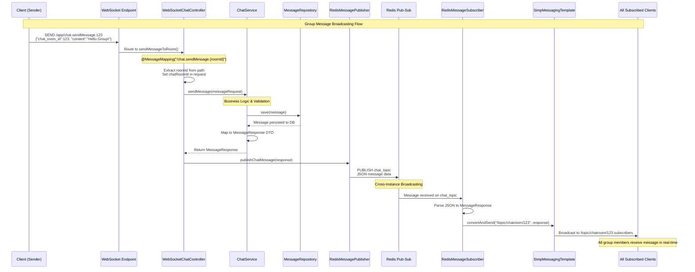

# WebSocket Configuration & Real-Time Messaging Guide

## 📋 Table of Contents

- [WebSocket Configuration Overview](#websocket-configuration-overview)
- [Classes & Their Roles](#classes--their-roles)
- [Client Subscription & Messaging Flow](#client-subscription--messaging-flow)
- [Message DTOs & Controllers for Group Messaging](#message-dtos--controllers-for-group-messaging)
- [Complete Message Flow: Reception to Broadcasting](#complete-message-flow-reception-to-broadcasting)
- [Step-by-Step Guide: Building Basic Group Messaging](#step-by-step-guide-building-basic-group-messaging)
- [Code Examples & Client Integration](#code-examples--client-integration)

## 🔧 WebSocket Configuration Overview

### Primary Configuration Class: `WebSocketConfig.java`

This is the **main configuration class** that sets up the entire WebSocket infrastructure:

```java
@Configuration
@EnableWebSocketMessageBroker  // Enables WebSocket message handling with STOMP
@RequiredArgsConstructor
@Order(Ordered.HIGHEST_PRECEDENCE + 99)
public class WebSocketConfig implements WebSocketMessageBrokerConfigurer
```

### 🎯 Key Configuration Methods

#### 1. **Message Broker Registration** (`configureMessageBroker`)

```java
@Override
public void configureMessageBroker(MessageBrokerRegistry config) {
    // Server-to-client destinations
    config.enableSimpleBroker("/topic", "/queue");

    // Client-to-server prefixes
    config.setApplicationDestinationPrefixes("/app");

    // User-specific destinations
    config.setUserDestinationPrefix("/user");
}
```

**What this means:**

- **`/topic`** - Broadcast messages (one-to-many) - used for chat rooms
- **`/queue`** - Point-to-point messages (one-to-one) - used for private messages
- **`/app`** - Prefix for messages sent from client to server
- **`/user`** - Prefix for user-specific destinations

#### 2. **Endpoint Registration** (`registerStompEndpoints`)

```java
@Override
public void registerStompEndpoints(StompEndpointRegistry registry) {
    // SockJS fallback support
    registry.addEndpoint("/ws")
            .setAllowedOriginPatterns(allowedOrigins.split(","))
            .withSockJS();

    // Direct WebSocket connection
    registry.addEndpoint("/chat")
            .setAllowedOriginPatterns(allowedOrigins.split(","));
}
```

**Connection Endpoints:**

- **`/ws`** - Primary endpoint with SockJS fallback for older browsers
- **`/chat`** - Direct WebSocket connection for modern browsers

#### 3. **JWT Authentication Setup** (`configureClientInboundChannel`)

```java
@Override
public void configureClientInboundChannel(ChannelRegistration registration) {
    registration.interceptors(new ChannelInterceptor() {
        @Override
        public Message<?> preSend(Message<?> message, MessageChannel channel) {
            // Extract JWT from Authorization header
            // Validate token and set authentication context
        }
    });
}
```

## 🏗️ Classes & Their Roles

### 1. **Configuration Classes**

| Class             | Role                         | Key Responsibilities                           |
| ----------------- | ---------------------------- | ---------------------------------------------- |
| `WebSocketConfig` | **Main WebSocket Setup**     | Endpoint registration, broker config, JWT auth |
| `RedisConfig`     | **Cross-Instance Messaging** | Redis pub-sub configuration for scaling        |
| `SecurityConfig`  | **Security Integration**     | JWT validation, CORS setup                     |

### 2. **Controller Classes**

| Class                     | Type                     | Purpose                            |
| ------------------------- | ------------------------ | ---------------------------------- |
| `WebSocketChatController` | **WebSocket Controller** | Handles real-time message routing  |
| `ChatController`          | **REST Controller**      | HTTP endpoints for chat operations |

### 3. **Service Classes**

| Class                    | Domain                  | Responsibilities                                    |
| ------------------------ | ----------------------- | --------------------------------------------------- |
| `ChatService`            | **Business Logic**      | Message processing, validation, persistence         |
| `RedisMessagePublisher`  | **Cross-Instance Sync** | Broadcasting messages via Redis                     |
| `RedisMessageSubscriber` | **Message Reception**   | Receiving Redis messages and WebSocket broadcasting |

### 4. **Security & Utility Classes**

| Class                      | Purpose              | Integration Point              |
| -------------------------- | -------------------- | ------------------------------ |
| `JwtUtils`                 | **Token Operations** | WebSocket authentication       |
| `CustomUserDetailsService` | **User Loading**     | Security context for WebSocket |

## 🔄 Client Subscription & Messaging Flow

### WebSocket Connection Flow

```javascript
// 1. Establish WebSocket Connection
const socket = new SockJS("/ws"); // or '/chat' for direct connection
const stompClient = Stomp.over(socket);

// 2. Connect with JWT Authentication
stompClient.connect(
  {
    Authorization: "Bearer " + jwtToken,
  },
  function (frame) {
    console.log("Connected: " + frame);

    // 3. Subscribe to Chat Room
    stompClient.subscribe("/topic/chatroom/123", function (message) {
      const messageData = JSON.parse(message.body);
      displayMessage(messageData);
    });

    // 4. Subscribe to User-Specific Queue (errors, private messages)
    stompClient.subscribe("/user/queue/errors", function (errorMessage) {
      handleError(errorMessage.body);
    });
  }
);
```

### Message Sending Flow

```javascript
// Send message to specific chat room
function sendMessage(roomId, content) {
  stompClient.send(
    "/app/chat.sendMessage." + roomId,
    {},
    JSON.stringify({
      chat_room_id: roomId,
      content: content,
      type: "TEXT",
    })
  );
}

// Send typing indicator
function sendTypingIndicator(roomId, isTyping) {
  stompClient.send(
    "/app/chat.typing." + roomId,
    {},
    JSON.stringify({
      chatRoomId: roomId,
      isTyping: isTyping,
    })
  );
}
```

### Subscription Patterns

| Pattern               | Endpoint                          | Use Case        | Message Flow          |
| --------------------- | --------------------------------- | --------------- | --------------------- |
| **Room Subscription** | `/topic/chatroom/{roomId}`        | Group messaging | One-to-many broadcast |
| **User Queue**        | `/user/{username}/queue/errors`   | Error handling  | One-to-one delivery   |
| **Status Updates**    | `/topic/chatroom/{roomId}/status` | User presence   | Broadcast to room     |
| **Typing Indicators** | `/topic/chatroom/{roomId}/typing` | Live typing     | Broadcast to room     |

## 📦 Message DTOs & Controllers for Group Messaging

### Core DTOs for Group Messaging

#### 1. **`SendMessageRequest.java`** - Client → Server

```java
@Data
@Builder
@Schema(description = "Send message request")
public class SendMessageRequest {
    @NotNull
    @JsonProperty("chat_room_id")
    private Long chatRoomId;           // Target chat room

    @NotBlank
    @Size(max = 5000)
    private String content;            // Message content

    @Builder.Default
    private String type = "TEXT";      // Message type (TEXT, IMAGE, FILE, SYSTEM)

    @JsonProperty("reply_to_message_id")
    private Long replyToMessageId;     // For threaded conversations

    @JsonProperty("file_url")
    private String fileUrl;            // File attachment URL

    @JsonProperty("file_name")
    private String fileName;           // File name for attachments

    @JsonProperty("file_size")
    private Long fileSize;             // File size in bytes
}
```

#### 2. **`MessageResponse.java`** - Server → Client

```java
@Data
@Builder
@Schema(description = "Message information")
public class MessageResponse {
    private Long id;                   // Message ID
    private String content;            // Message content
    private String type;               // Message type
    private SenderInfo sender;         // Sender information

    @JsonProperty("chat_room_id")
    private Long chatRoomId;           // Chat room ID

    private LocalDateTime timestamp;   // When message was sent

    @JsonProperty("is_edited")
    private Boolean isEdited;          // Edit status

    @JsonProperty("file_url")
    private String fileUrl;            // File attachment URL

    @JsonProperty("reply_to")
    private ReplyToMessage replyTo;    // Reply thread information

    // Nested DTOs for sender info and reply context
    @Data
    @Builder
    public static class SenderInfo {
        private Long id;
        private String username;
        @JsonProperty("full_name")
        private String fullName;
        @JsonProperty("profile_picture_url")
        private String profilePictureUrl;
        @JsonProperty("is_online")
        private Boolean isOnline;
    }
}
```

#### 3. **Internal DTOs** (in WebSocketChatController)

```java
// Typing indicator DTO
public static class TypingIndicator {
    private String username;
    private boolean isTyping;
    private String chatRoomId;
}

// User connection event DTO
public static class UserConnectionEvent {
    private String type;        // JOIN, LEAVE
    private String username;
}
```

### Controller Methods for Group Messaging

#### **`WebSocketChatController.java`** - Real-time Handlers

```java
@Controller
@RequiredArgsConstructor
@Slf4j
public class WebSocketChatController {

    // 1. MAIN GROUP MESSAGING ENDPOINT
    @MessageMapping("/chat.sendMessage.{roomId}")
    public void sendMessageToRoom(
        @DestinationVariable String roomId,
        @Payload SendMessageRequest messageRequest,
        Principal principal) {

        // Set room ID from URL path
        messageRequest.setChatRoomId(Long.parseLong(roomId));

        // Process through business logic
        MessageResponse response = chatService.sendMessage(messageRequest);

        // Broadcast to all room subscribers
        String destination = "/topic/chatroom/" + roomId;
        messagingTemplate.convertAndSend(destination, response);
    }

    // 2. ROOM SUBSCRIPTION HANDLER
    @SubscribeMapping("/topic/chatroom/{roomId}")
    public void subscribeToRoom(
        @DestinationVariable String roomId,
        Principal principal) {

        // Update user online status
        userService.updateOnlineStatus(principal.getName(), true);

        // Notify others of user presence
        String statusDestination = "/topic/chatroom/" + roomId + "/status";
        messagingTemplate.convertAndSend(statusDestination,
            principal.getName() + " is now online");
    }

    // 3. TYPING INDICATORS
    @MessageMapping("/chat.typing.{roomId}")
    public void handleTyping(
        @DestinationVariable String roomId,
        @Payload TypingIndicator typingIndicator,
        Principal principal) {

        typingIndicator.setUsername(principal.getName());

        String destination = "/topic/chatroom/" + roomId + "/typing";
        messagingTemplate.convertAndSend(destination, typingIndicator);
    }

    // 4. USER CONNECTION EVENTS
    @MessageMapping("/chat.addUser")
    @SendTo("/topic/public")
    public UserConnectionEvent addUser(
        @Payload UserConnectionEvent connectionEvent,
        Principal principal) {

        connectionEvent.setUsername(principal.getName());
        connectionEvent.setType("JOIN");

        return connectionEvent;
    }
}
```

## 🔄 Complete Message Flow: Reception to Broadcasting

### Step-by-Step Message Flow



### Detailed Code Flow

#### 1. **WebSocket Message Reception**

```java
// In WebSocketChatController
@MessageMapping("/chat.sendMessage.{roomId}")
public void sendMessageToRoom(@DestinationVariable String roomId,
                             @Payload SendMessageRequest messageRequest,
                             Principal principal) {
    try {
        // Extract room ID from URL path parameter
        Long chatRoomId = Long.parseLong(roomId);
        messageRequest.setChatRoomId(chatRoomId);

        log.info("WebSocket room message from user: {} to room: {}",
                 principal.getName(), roomId);

        // Process message through business layer
        MessageResponse response = chatService.sendMessage(messageRequest);

        // Broadcast to specific room topic
        String destination = "/topic/chatroom/" + roomId;
        messagingTemplate.convertAndSend(destination, response);

        log.info("Message sent to room topic: {}", destination);

    } catch (Exception e) {
        // Error handling - send error to user's private queue
        String errorDestination = "/user/" + principal.getName() + "/queue/errors";
        messagingTemplate.convertAndSend(errorDestination,
                "Failed to send message: " + e.getMessage());
    }
}
```

#### 2. **Business Logic Processing** (in ChatService)

```java
@Transactional
public MessageResponse sendMessage(SendMessageRequest request) {
    // 1. Authentication & Authorization
    String currentUsername = SecurityContextHolder.getContext().getAuthentication().getName();
    User sender = userRepository.findByUsername(currentUsername)
            .orElseThrow(() -> new UsernameNotFoundException("Sender not found"));

    // 2. Validate chat room access
    ChatRoom chatRoom = chatRoomRepository.findById(request.getChatRoomId())
            .orElseThrow(() -> new ChatRoomNotFoundException("Chat room not found"));

    if (!isUserParticipant(chatRoom, sender)) {
        throw new AccessDeniedException("User is not a participant in this chat room");
    }

    // 3. Build and save message
    Message message = Message.builder()
            .content(request.getContent())
            .type(MessageType.valueOf(request.getType()))
            .sender(sender)
            .chatRoom(chatRoom)
            .timestamp(LocalDateTime.now())
            .fileUrl(request.getFileUrl())
            .fileName(request.getFileName())
            .fileSize(request.getFileSize())
            .replyToMessage(getReplyToMessage(request.getReplyToMessageId()))
            .build();

    message = messageRepository.save(message);

    // 4. Create response DTO
    MessageResponse response = mapToMessageResponse(message);

    // 5. Publish to Redis for cross-instance broadcasting
    redisMessagePublisher.publishChatMessage(response);

    return response;
}
```

#### 3. **Redis Cross-Instance Broadcasting**

```java
// RedisMessagePublisher
@Service
public class RedisMessagePublisher {

    public void publishChatMessage(MessageResponse message) {
        try {
            String messageJson = objectMapper.writeValueAsString(message);
            redisTemplate.convertAndSend(RedisConfig.CHAT_TOPIC, messageJson);

            log.debug("Published chat message to Redis: {}", message.getId());
        } catch (Exception e) {
            log.error("Failed to publish chat message to Redis", e);
        }
    }
}
```

#### 4. **Redis Message Reception & WebSocket Broadcasting**

```java
// RedisMessageSubscriber
@Component
public class RedisMessageSubscriber implements MessageListener {

    @Override
    public void onMessage(Message message, byte[] pattern) {
        try {
            String channel = new String(message.getChannel());
            String messageBody = new String(message.getBody());

            if (RedisConfig.CHAT_TOPIC.equals(channel)) {
                handleChatMessage(messageBody);
            }
        } catch (Exception e) {
            log.error("Failed to process Redis message", e);
        }
    }

    private void handleChatMessage(String messageBody) {
        try {
            MessageResponse messageResponse = objectMapper.readValue(messageBody, MessageResponse.class);

            // Broadcast to WebSocket clients
            String destination = "/topic/chatroom/" + messageResponse.getChatRoomId();
            messagingTemplate.convertAndSend(destination, messageResponse);

            log.debug("Chat message broadcasted to: {}", destination);
        } catch (Exception e) {
            log.error("Failed to handle chat message", e);
        }
    }
}
```

## 🛠️ Step-by-Step Guide: Building Basic Group Messaging

### Prerequisites

- Spring Boot 3.5.6+
- Java 21+
- PostgreSQL database
- Redis server (for multi-instance support)

### Step 1: **Dependencies** (pom.xml)

```xml
<dependencies>
    <!-- Core Spring Boot -->
    <dependency>
        <groupId>org.springframework.boot</groupId>
        <artifactId>spring-boot-starter-web</artifactId>
    </dependency>

    <!-- WebSocket Support -->
    <dependency>
        <groupId>org.springframework.boot</groupId>
        <artifactId>spring-boot-starter-websocket</artifactId>
    </dependency>

    <!-- Security & JWT -->
    <dependency>
        <groupId>org.springframework.boot</groupId>
        <artifactId>spring-boot-starter-security</artifactId>
    </dependency>
    <dependency>
        <groupId>io.jsonwebtoken</groupId>
        <artifactId>jjwt-api</artifactId>
        <version>0.12.3</version>
    </dependency>

    <!-- Database -->
    <dependency>
        <groupId>org.springframework.boot</groupId>
        <artifactId>spring-boot-starter-data-jpa</artifactId>
    </dependency>
    <dependency>
        <groupId>org.postgresql</groupId>
        <artifactId>postgresql</artifactId>
    </dependency>

    <!-- Redis -->
    <dependency>
        <groupId>org.springframework.boot</groupId>
        <artifactId>spring-boot-starter-data-redis</artifactId>
    </dependency>

    <!-- Utilities -->
    <dependency>
        <groupId>org.projectlombok</groupId>
        <artifactId>lombok</artifactId>
    </dependency>
    <dependency>
        <groupId>org.springframework.boot</groupId>
        <artifactId>spring-boot-starter-validation</artifactId>
    </dependency>
</dependencies>
```

### Step 2: **Configuration Classes**

#### **WebSocketConfig.java** ⭐ (Essential)

```java
@Configuration
@EnableWebSocketMessageBroker
@RequiredArgsConstructor
public class WebSocketConfig implements WebSocketMessageBrokerConfigurer {

    private final JwtUtils jwtUtils;
    private final UserDetailsService userDetailsService;

    @Value("${app.websocket.allowed-origins:*}")
    private String allowedOrigins;

    @Override
    public void configureMessageBroker(MessageBrokerRegistry config) {
        config.enableSimpleBroker("/topic", "/queue");
        config.setApplicationDestinationPrefixes("/app");
        config.setUserDestinationPrefix("/user");
    }

    @Override
    public void registerStompEndpoints(StompEndpointRegistry registry) {
        registry.addEndpoint("/ws")
                .setAllowedOriginPatterns(allowedOrigins.split(","))
                .withSockJS();
    }

    @Override
    public void configureClientInboundChannel(ChannelRegistration registration) {
        registration.interceptors(new ChannelInterceptor() {
            @Override
            public Message<?> preSend(Message<?> message, MessageChannel channel) {
                StompHeaderAccessor accessor = MessageHeaderAccessor.getAccessor(message, StompHeaderAccessor.class);

                if (StompCommand.CONNECT.equals(accessor.getCommand())) {
                    List<String> authorization = accessor.getNativeHeader("Authorization");

                    if (authorization != null && !authorization.isEmpty()) {
                        String token = authorization.get(0);
                        if (token.startsWith("Bearer ")) {
                            token = token.substring(7);

                            String username = jwtUtils.extractUsername(token);
                            if (username != null && !jwtUtils.isTokenExpired(token)) {
                                UserDetails userDetails = userDetailsService.loadUserByUsername(username);

                                if (jwtUtils.validateToken(token, userDetails)) {
                                    UsernamePasswordAuthenticationToken authentication =
                                        new UsernamePasswordAuthenticationToken(
                                            userDetails, null, userDetails.getAuthorities());
                                    accessor.setUser(authentication);
                                }
                            }
                        }
                    }
                }
                return message;
            }
        });
    }
}
```

#### **RedisConfig.java** ⭐ (For Scaling)

```java
@Configuration
@EnableConfigurationProperties
@RequiredArgsConstructor
public class RedisConfig {

    public static final String CHAT_TOPIC = "chat_topic";

    @Bean
    public RedisTemplate<String, Object> redisTemplate(RedisConnectionFactory connectionFactory) {
        RedisTemplate<String, Object> template = new RedisTemplate<>();
        template.setConnectionFactory(connectionFactory);
        template.setDefaultSerializer(new GenericJackson2JsonRedisSerializer());
        return template;
    }

    @Bean
    public RedisMessageListenerContainer redisContainer(RedisConnectionFactory connectionFactory,
                                                        RedisMessageSubscriber messageSubscriber) {
        RedisMessageListenerContainer container = new RedisMessageListenerContainer();
        container.setConnectionFactory(connectionFactory);
        container.addMessageListener(messageSubscriber, new PatternTopic(CHAT_TOPIC));
        return container;
    }
}
```

### Step 3: **Entity Classes**

#### **User.java** ⭐ (Authentication)

```java
@Entity
@Table(name = "users")
@Data
@Builder
@NoArgsConstructor
@AllArgsConstructor
public class User implements UserDetails {

    @Id
    @GeneratedValue(strategy = GenerationType.IDENTITY)
    private Long id;

    @Column(unique = true, nullable = false)
    private String username;

    @Column(unique = true, nullable = false)
    private String email;

    @Column(nullable = false)
    private String password;

    @Column(name = "full_name")
    private String fullName;

    @Enumerated(EnumType.STRING)
    @Builder.Default
    private Role role = Role.USER;

    @Builder.Default
    private Boolean isOnline = false;

    @Column(name = "last_seen")
    private LocalDateTime lastSeen;

    // Spring Security UserDetails implementation
    @Override
    public Collection<? extends GrantedAuthority> getAuthorities() {
        return List.of(new SimpleGrantedAuthority("ROLE_" + role.name()));
    }

    @Override
    public boolean isAccountNonExpired() { return true; }
    @Override
    public boolean isAccountNonLocked() { return true; }
    @Override
    public boolean isCredentialsNonExpired() { return true; }
    @Override
    public boolean isEnabled() { return true; }
}
```

#### **ChatRoom.java** ⭐ (Core Entity)

```java
@Entity
@Table(name = "chat_rooms")
@Data
@Builder
@NoArgsConstructor
@AllArgsConstructor
public class ChatRoom {

    @Id
    @GeneratedValue(strategy = GenerationType.IDENTITY)
    private Long id;

    @Column(nullable = false, length = 100)
    private String name;

    @Column(length = 500)
    private String description;

    @Enumerated(EnumType.STRING)
    @Column(nullable = false)
    private ChatRoomType type;  // DIRECT, GROUP

    @ManyToOne(fetch = FetchType.LAZY)
    @JoinColumn(name = "created_by", nullable = false)
    private User createdBy;

    @Column(name = "created_at", nullable = false)
    private LocalDateTime createdAt;

    @Builder.Default
    private Boolean isActive = true;

    @ManyToMany(fetch = FetchType.LAZY)
    @JoinTable(
        name = "chat_room_participants",
        joinColumns = @JoinColumn(name = "chat_room_id"),
        inverseJoinColumns = @JoinColumn(name = "user_id")
    )
    @Builder.Default
    private Set<User> participants = new HashSet<>();
}
```

#### **Message.java** ⭐ (Message Storage)

```java
@Entity
@Table(name = "messages")
@Data
@Builder
@NoArgsConstructor
@AllArgsConstructor
public class Message {

    @Id
    @GeneratedValue(strategy = GenerationType.IDENTITY)
    private Long id;

    @Column(columnDefinition = "TEXT")
    private String content;

    @Enumerated(EnumType.STRING)
    @Column(nullable = false)
    private MessageType type;  // TEXT, FILE, IMAGE, SYSTEM

    @ManyToOne(fetch = FetchType.LAZY)
    @JoinColumn(name = "sender_id", nullable = false)
    private User sender;

    @ManyToOne(fetch = FetchType.LAZY)
    @JoinColumn(name = "chat_room_id", nullable = false)
    private ChatRoom chatRoom;

    @Column(nullable = false)
    private LocalDateTime timestamp;

    @Column(name = "file_url")
    private String fileUrl;

    @Column(name = "file_name")
    private String fileName;

    @Column(name = "file_size")
    private Long fileSize;

    @ManyToOne(fetch = FetchType.LAZY)
    @JoinColumn(name = "reply_to_message_id")
    private Message replyToMessage;

    @Builder.Default
    private Boolean isDeleted = false;

    @Builder.Default
    private Boolean isEdited = false;

    @Column(name = "edited_at")
    private LocalDateTime editedAt;
}
```

### Step 4: **DTO Classes**

#### **SendMessageRequest.java** ⭐ (Client Input)

```java
@Data
@Builder
@NoArgsConstructor
@AllArgsConstructor
public class SendMessageRequest {

    @NotNull(message = "Chat room ID is required")
    @JsonProperty("chat_room_id")
    private Long chatRoomId;

    @NotBlank(message = "Content is required")
    @Size(max = 5000, message = "Message content must not exceed 5000 characters")
    private String content;

    @Builder.Default
    private String type = "TEXT";

    @JsonProperty("reply_to_message_id")
    private Long replyToMessageId;

    @JsonProperty("file_url")
    private String fileUrl;

    @JsonProperty("file_name")
    private String fileName;

    @JsonProperty("file_size")
    private Long fileSize;
}
```

#### **MessageResponse.java** ⭐ (Server Output)

```java
@Data
@Builder
@NoArgsConstructor
@AllArgsConstructor
public class MessageResponse {

    private Long id;
    private String content;
    private String type;
    private SenderInfo sender;

    @JsonProperty("chat_room_id")
    private Long chatRoomId;

    private LocalDateTime timestamp;

    @JsonProperty("is_edited")
    private Boolean isEdited;

    @JsonProperty("file_url")
    private String fileUrl;

    @JsonProperty("file_name")
    private String fileName;

    @Data
    @Builder
    @NoArgsConstructor
    @AllArgsConstructor
    public static class SenderInfo {
        private Long id;
        private String username;
        @JsonProperty("full_name")
        private String fullName;
        @JsonProperty("is_online")
        private Boolean isOnline;
    }
}
```

### Step 5: **Repository Interfaces**

#### **UserRepository.java** ⭐

```java
@Repository
public interface UserRepository extends JpaRepository<User, Long> {
    Optional<User> findByUsername(String username);
    Optional<User> findByEmail(String email);
    boolean existsByUsername(String username);
    boolean existsByEmail(String email);
}
```

#### **ChatRoomRepository.java** ⭐

```java
@Repository
public interface ChatRoomRepository extends JpaRepository<ChatRoom, Long> {
    List<ChatRoom> findByParticipantsContaining(User participant);
    List<ChatRoom> findByTypeAndIsActiveTrue(ChatRoomType type);

    @Query("SELECT cr FROM ChatRoom cr JOIN cr.participants p WHERE p.id = :userId AND cr.isActive = true")
    Page<ChatRoom> findActiveRoomsByUserId(@Param("userId") Long userId, Pageable pageable);
}
```

#### **MessageRepository.java** ⭐

```java
@Repository
public interface MessageRepository extends JpaRepository<Message, Long> {
    Page<Message> findByChatRoomIdAndIsDeletedFalseOrderByTimestampDesc(Long chatRoomId, Pageable pageable);
    List<Message> findByChatRoomIdAndIsDeletedFalseOrderByTimestampAsc(Long chatRoomId);
    long countByChatRoomIdAndIsDeletedFalse(Long chatRoomId);
}
```

### Step 6: **Service Classes**

#### **ChatService.java** ⭐ (Core Business Logic)

```java
@Service
@RequiredArgsConstructor
@Slf4j
@Transactional
public class ChatService {

    private final ChatRoomRepository chatRoomRepository;
    private final MessageRepository messageRepository;
    private final UserRepository userRepository;
    private final RedisMessagePublisher redisMessagePublisher;

    public MessageResponse sendMessage(SendMessageRequest request) {
        // 1. Get authenticated user
        String currentUsername = SecurityContextHolder.getContext().getAuthentication().getName();
        User sender = userRepository.findByUsername(currentUsername)
                .orElseThrow(() -> new UsernameNotFoundException("Sender not found"));

        // 2. Validate chat room access
        ChatRoom chatRoom = chatRoomRepository.findById(request.getChatRoomId())
                .orElseThrow(() -> new RuntimeException("Chat room not found"));

        if (!chatRoom.getParticipants().contains(sender)) {
            throw new AccessDeniedException("User is not a participant in this chat room");
        }

        // 3. Create and save message
        Message message = Message.builder()
                .content(request.getContent())
                .type(MessageType.valueOf(request.getType()))
                .sender(sender)
                .chatRoom(chatRoom)
                .timestamp(LocalDateTime.now())
                .fileUrl(request.getFileUrl())
                .fileName(request.getFileName())
                .fileSize(request.getFileSize())
                .build();

        message = messageRepository.save(message);

        // 4. Create response DTO
        MessageResponse response = mapToMessageResponse(message);

        // 5. Publish to Redis for cross-instance broadcasting
        redisMessagePublisher.publishChatMessage(response);

        return response;
    }

    private MessageResponse mapToMessageResponse(Message message) {
        return MessageResponse.builder()
                .id(message.getId())
                .content(message.getContent())
                .type(message.getType().name())
                .chatRoomId(message.getChatRoom().getId())
                .timestamp(message.getTimestamp())
                .isEdited(message.getIsEdited())
                .fileUrl(message.getFileUrl())
                .fileName(message.getFileName())
                .sender(MessageResponse.SenderInfo.builder()
                        .id(message.getSender().getId())
                        .username(message.getSender().getUsername())
                        .fullName(message.getSender().getFullName())
                        .isOnline(message.getSender().getIsOnline())
                        .build())
                .build();
    }
}
```

### Step 7: **WebSocket Controller** ⭐ (Real-time Handler)

#### **WebSocketChatController.java**

```java
@Controller
@RequiredArgsConstructor
@Slf4j
public class WebSocketChatController {

    private final ChatService chatService;
    private final SimpMessagingTemplate messagingTemplate;

    @MessageMapping("/chat.sendMessage.{roomId}")
    public void sendMessageToRoom(@DestinationVariable String roomId,
                                 @Payload SendMessageRequest messageRequest,
                                 Principal principal) {
        try {
            Long chatRoomId = Long.parseLong(roomId);
            messageRequest.setChatRoomId(chatRoomId);

            log.info("WebSocket room message from user: {} to room: {}",
                     principal.getName(), roomId);

            // Process message
            MessageResponse response = chatService.sendMessage(messageRequest);

            // Send to specific room topic
            String destination = "/topic/chatroom/" + roomId;
            messagingTemplate.convertAndSend(destination, response);

            log.info("Message sent to room topic: {}", destination);

        } catch (Exception e) {
            log.error("Failed to send message to room: {}", roomId, e);

            // Send error back to user
            String errorDestination = "/user/" + principal.getName() + "/queue/errors";
            messagingTemplate.convertAndSend(errorDestination,
                    "Failed to send message: " + e.getMessage());
        }
    }

    @SubscribeMapping("/topic/chatroom/{roomId}")
    public void subscribeToRoom(@DestinationVariable String roomId, Principal principal) {
        log.info("User {} subscribed to chat room: {}", principal.getName(), roomId);

        // Notify others of user presence
        String destination = "/topic/chatroom/" + roomId + "/status";
        messagingTemplate.convertAndSend(destination,
                principal.getName() + " joined the room");
    }
}
```

### Step 8: **Redis Integration** ⭐ (Multi-Instance Support)

#### **RedisMessagePublisher.java**

```java
@Service
@RequiredArgsConstructor
@Slf4j
public class RedisMessagePublisher {

    private final RedisTemplate<String, Object> redisTemplate;
    private final ObjectMapper objectMapper;

    public void publishChatMessage(MessageResponse message) {
        try {
            String messageJson = objectMapper.writeValueAsString(message);
            redisTemplate.convertAndSend(RedisConfig.CHAT_TOPIC, messageJson);

            log.debug("Published chat message to Redis: {}", message.getId());
        } catch (Exception e) {
            log.error("Failed to publish chat message to Redis", e);
        }
    }
}
```

#### **RedisMessageSubscriber.java**

```java
@Component
@RequiredArgsConstructor
@Slf4j
public class RedisMessageSubscriber implements MessageListener {

    private final SimpMessagingTemplate messagingTemplate;
    private final ObjectMapper objectMapper;

    @Override
    public void onMessage(Message message, byte[] pattern) {
        try {
            String channel = new String(message.getChannel());
            String messageBody = new String(message.getBody());

            if (RedisConfig.CHAT_TOPIC.equals(channel)) {
                handleChatMessage(messageBody);
            }
        } catch (Exception e) {
            log.error("Failed to process Redis message", e);
        }
    }

    private void handleChatMessage(String messageBody) {
        try {
            MessageResponse messageResponse = objectMapper.readValue(messageBody, MessageResponse.class);

            // Broadcast to WebSocket clients
            String destination = "/topic/chatroom/" + messageResponse.getChatRoomId();
            messagingTemplate.convertAndSend(destination, messageResponse);

            log.debug("Chat message broadcasted to: {}", destination);
        } catch (Exception e) {
            log.error("Failed to handle chat message", e);
        }
    }
}
```

### Step 9: **Security Configuration** ⭐ (JWT Integration)

#### **SecurityConfig.java** (Minimal WebSocket-focused)

```java
@Configuration
@EnableWebSecurity
@RequiredArgsConstructor
public class SecurityConfig {

    @Bean
    public SecurityFilterChain filterChain(HttpSecurity http) throws Exception {
        http
            .csrf(csrf -> csrf.disable())
            .sessionManagement(session -> session.sessionCreationPolicy(SessionCreationPolicy.STATELESS))
            .authorizeHttpRequests(authz -> authz
                .requestMatchers("/ws/**", "/chat/**").permitAll()  // WebSocket endpoints
                .requestMatchers("/api/auth/**").permitAll()        // Auth endpoints
                .anyRequest().authenticated()
            );
        return http.build();
    }

    @Bean
    public PasswordEncoder passwordEncoder() {
        return new BCryptPasswordEncoder();
    }
}
```

### Step 10: **Application Properties**

```properties
# Database Configuration
spring.datasource.url=jdbc:postgresql://localhost:5432/chatapp
spring.datasource.username=chatapp_user
spring.datasource.password=chatapp_password
spring.jpa.hibernate.ddl-auto=update
spring.jpa.show-sql=true

# Redis Configuration
spring.data.redis.host=localhost
spring.data.redis.port=6379
spring.data.redis.timeout=2000ms

# WebSocket Configuration
app.websocket.allowed-origins=http://localhost:3000,http://localhost:8080

# JWT Configuration
app.jwt.secret=mySecretKey
app.jwt.expiration=86400000
app.jwt.refresh-expiration=604800000
```

## 🖥️ Code Examples & Client Integration

### Frontend WebSocket Client (JavaScript)

```javascript
class ChatClient {
  constructor(jwtToken) {
    this.jwtToken = jwtToken;
    this.stompClient = null;
    this.currentRoomId = null;
  }

  connect() {
    const socket = new SockJS("/ws");
    this.stompClient = Stomp.over(socket);

    this.stompClient.connect(
      {
        Authorization: "Bearer " + this.jwtToken,
      },
      (frame) => {
        console.log("Connected: " + frame);
        this.onConnected();
      },
      (error) => {
        console.error("Connection error:", error);
      }
    );
  }

  onConnected() {
    // Subscribe to error queue
    this.stompClient.subscribe("/user/queue/errors", (message) => {
      console.error("Error:", message.body);
      this.showError(message.body);
    });
  }

  joinRoom(roomId) {
    if (this.currentRoomId) {
      this.leaveRoom(this.currentRoomId);
    }

    this.currentRoomId = roomId;

    // Subscribe to room messages
    this.stompClient.subscribe(`/topic/chatroom/${roomId}`, (message) => {
      const messageData = JSON.parse(message.body);
      this.displayMessage(messageData);
    });

    // Subscribe to room status updates
    this.stompClient.subscribe(
      `/topic/chatroom/${roomId}/status`,
      (message) => {
        this.showStatusUpdate(message.body);
      }
    );

    // Subscribe to typing indicators
    this.stompClient.subscribe(
      `/topic/chatroom/${roomId}/typing`,
      (message) => {
        const typingData = JSON.parse(message.body);
        this.showTypingIndicator(typingData);
      }
    );
  }

  sendMessage(content) {
    if (this.currentRoomId && content.trim()) {
      const messageRequest = {
        chat_room_id: this.currentRoomId,
        content: content,
        type: "TEXT",
      };

      this.stompClient.send(
        `/app/chat.sendMessage.${this.currentRoomId}`,
        {},
        JSON.stringify(messageRequest)
      );
    }
  }

  sendTyping(isTyping) {
    if (this.currentRoomId) {
      const typingIndicator = {
        chatRoomId: this.currentRoomId,
        isTyping: isTyping,
      };

      this.stompClient.send(
        `/app/chat.typing.${this.currentRoomId}`,
        {},
        JSON.stringify(typingIndicator)
      );
    }
  }

  displayMessage(message) {
    const messageElement = document.createElement("div");
    messageElement.className = "message";
    messageElement.innerHTML = `
            <div class="message-header">
                <span class="sender">${
                  message.sender.full_name || message.sender.username
                }</span>
                <span class="timestamp">${new Date(
                  message.timestamp
                ).toLocaleTimeString()}</span>
            </div>
            <div class="message-content">${message.content}</div>
        `;

    document.getElementById("chat-messages").appendChild(messageElement);
    this.scrollToBottom();
  }

  showTypingIndicator(typingData) {
    const indicator = document.getElementById("typing-indicator");
    if (typingData.isTyping) {
      indicator.textContent = `${typingData.username} is typing...`;
      indicator.style.display = "block";
    } else {
      indicator.style.display = "none";
    }
  }

  showStatusUpdate(status) {
    const statusElement = document.createElement("div");
    statusElement.className = "status-message";
    statusElement.textContent = status;
    document.getElementById("chat-messages").appendChild(statusElement);
  }

  showError(error) {
    const errorElement = document.createElement("div");
    errorElement.className = "error-message";
    errorElement.textContent = error;
    document.getElementById("chat-messages").appendChild(errorElement);
  }

  scrollToBottom() {
    const chatMessages = document.getElementById("chat-messages");
    chatMessages.scrollTop = chatMessages.scrollHeight;
  }

  disconnect() {
    if (this.stompClient) {
      this.stompClient.disconnect();
    }
  }
}

// Usage
const chatClient = new ChatClient("your-jwt-token-here");
chatClient.connect();

// Join a room
chatClient.joinRoom(123);

// Send a message
document.getElementById("message-input").addEventListener("keypress", (e) => {
  if (e.key === "Enter") {
    const content = e.target.value;
    chatClient.sendMessage(content);
    e.target.value = "";
  }
});

// Typing indicator
let typingTimer;
document.getElementById("message-input").addEventListener("input", (e) => {
  chatClient.sendTyping(true);

  clearTimeout(typingTimer);
  typingTimer = setTimeout(() => {
    chatClient.sendTyping(false);
  }, 1000);
});
```

## 🎯 Key Takeaways

### **Essential Classes for Basic Group Messaging:**

1. **Configuration**: `WebSocketConfig`, `RedisConfig`
2. **Entities**: `User`, `ChatRoom`, `Message`
3. **DTOs**: `SendMessageRequest`, `MessageResponse`
4. **Repositories**: `UserRepository`, `ChatRoomRepository`, `MessageRepository`
5. **Services**: `ChatService`
6. **Controllers**: `WebSocketChatController`
7. **Redis**: `RedisMessagePublisher`, `RedisMessageSubscriber`

### **Message Flow Summary:**

1. **Client sends** → `/app/chat.sendMessage.{roomId}`
2. **WebSocket controller** → `sendMessageToRoom()`
3. **Business logic** → `ChatService.sendMessage()`
4. **Database** → `MessageRepository.save()`
5. **Redis publish** → Cross-instance broadcasting
6. **Redis subscribe** → `RedisMessageSubscriber`
7. **WebSocket broadcast** → `/topic/chatroom/{roomId}`
8. **All clients receive** → Real-time message delivery

This architecture provides a robust, scalable foundation for real-time group messaging with comprehensive error handling, security, and multi-instance support!
